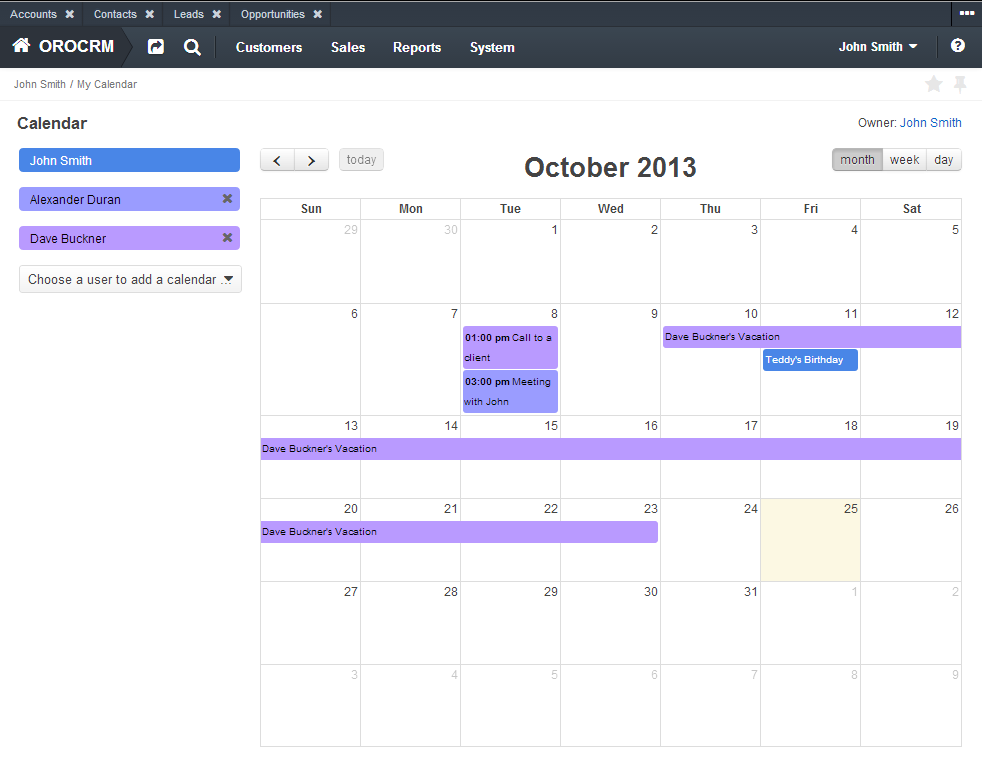

Oro Calendar Bundle
=======================

This bundle integrates the [jQuery FullCalendar](http://arshaw.com/fullcalendar/) plugin into BAP and provides other calendar related functionality, such as view calendars of other users, reminders, synchronization with external calendars.

UI
--
The user's calendar is available under an user menu at the top right corner of a screen.
.

Reminders
---------
Currently it is possible to allow BAP to send a notification to your mailbox at 15 minutes before a calendar events begins. To allow a calendar do this you need select `Reminder` checkbox when you create an event. To change the reminder time just add the following in your application config:
``` yaml
oro_calendar:
    # calendar reminder time in minutes
    reminder_time: 10
```
To check schedule of calendar events and determine which notification need to be sent the `OroCalendarBundle` provides a command for [OroCronBundle](../CronBundle/README.md). Please make sure that this bundle is properly configured. Also you can run this command manually:
``` bash
php app/console oro:cron:send-calendar-reminders
```
