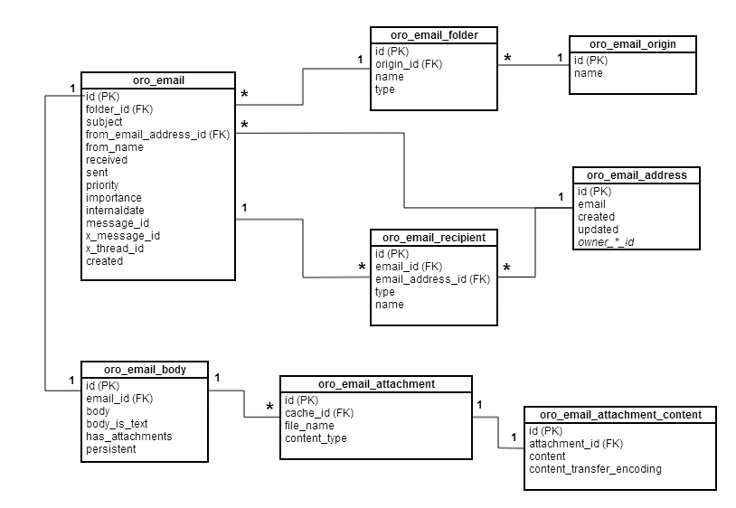

Emails
=======

Sending emails without a spool
------------------------------
In some cases you need to send an email directly, bypassing a spool even when you application is configured to use the spool. To achieve this you can use `oro_email.direct_mailer` service.

Database Diagram
----------------


Email Address Owners
--------------------
Each email address can be connected to an entity object which is an owner of this email address. An email address can have one and only one owner. By now User and Contact entities can own an email address. But other entities can be easily configured for this purposes. Let's take a look which changes were made in OroUserBundle to allow User entity be an owner:

UserBundle/Entity/User.php

``` php
<?php

namespace Oro\Bundle\UserBundle\Entity;

...
use Oro\Bundle\EmailBundle\Entity\EmailOwnerInterface;

class User extends AbstractEntityFlexible implements
    AdvancedUserInterface,
    \Serializable,
    EntityUploadedImageInterface,
    Taggable,
    EmailOwnerInterface
{
    ...
}
```
UserBundle/Entity/Email.php

``` php
<?php

namespace Oro\Bundle\UserBundle\Entity;

...
use Oro\Bundle\EmailBundle\Entity\EmailInterface;

class Email implements EmailInterface
{
    ...
}
```
UserBundle/Entity/Provider/EmailOwnerProvider.php

``` php
<?php

namespace Oro\Bundle\UserBundle\Entity\Provider;

use Doctrine\ORM\EntityManager;
use Oro\Bundle\UserBundle\Entity\User;
use Oro\Bundle\UserBundle\Entity\Email;
use Oro\Bundle\EmailBundle\Entity\Provider\EmailOwnerProviderInterface;

class EmailOwnerProvider implements EmailOwnerProviderInterface
{
    /**
     * {@inheritdoc}
     */
    public function getEmailOwnerClass()
    {
        return 'Oro\Bundle\UserBundle\Entity\User';
    }
    /**
     * {@inheritdoc}
     */
    public function findEmailOwner(EntityManager $em, $email)
    {
        /** @var User $user */
        $user = $em->getRepository('OroUserBundle:User')
            ->findOneBy(array('email' => $email));
        if ($user === null) {
            /** @var Email $emailEntity */
            $emailEntity = $em->getRepository('OroUserBundle:Email')
                ->findOneBy(array('email' => $email));
            if ($emailEntity !== null) {
                $user = $emailEntity->getUser();
            }
        }
        return $user;
    }
}
```
UserBundle/Resources/config/services.yml

``` yaml
parameters:
    ...
    oro_user.email.owner.provider.class: Oro\Bundle\UserBundle\Entity\Provider\EmailOwnerProvider

services:
    ...
    oro_user.email.owner.provider:
        class: %oro_user.email.owner.provider.class%
        tags:
            - { name: oro_email.owner.provider, order: 1 }
```
As you have seen in code blocks above, it is pretty easy to configure new owner. Just do the following:

 - Implement EmailOwnerInterface in entity which you wish to made an email address owner
 - Implement EmailInterface in entity which is responsible to store emails
 - Implement EmailOwnerProviderInterface in your bundle. This interface has two methods. The getEmailOwnerClass one should return full name of your entity class. The findEmailOwner method searches an owner entity by given email address.
 - Register your email owner provider as a service and mark it by oro_email.owner.provider tag. The order attribute is optional and can be used to resolve ambiguous when several email address owners have the same email address. In this case wins an owner with lower value of the order attribute.
Before the system can work with your email address owner you have to do two things:
 - Update the database schema using **php app/console doctrine:schema:update** command. The new foreign key will be created in oro_email_address table.
 - Run **php app/console cache:warmup** command to regenerate doctrine proxy class used to work with EmailAddress entity. This class is located at app/entities/Extend/Cache/OroEmailBundle/Entity directory.

Email Body and Attachments Loaders
----------------------------------
As emails may be loaded from different sort of sources, for example using IMAP protocol or through Exchange Web Services, we need a way to get email body and attachments for already loaded emails. To add new loader you need to do the following steps:

 - Create a class implements EmailBodyLoaderInterface.
 - Register it in DI and mark it with oro_email.email_body_loader tag.

For example:

AcmeEmailBodyLoader.php

``` php
<?php

class AcmeEmailBodyLoader implements EmailBodyLoaderInterface
    /**
     * {@inheritdoc}
     */
    public function supports(EmailOrigin $origin)
    {
        return $origin instanceof AcmeEmailOrigin;
    }
    /**
     * {@inheritdoc}
     */
    public function loadEmailBody(Email $email, EntityManager $em)
    {
    }
}
```
services.yml

``` yaml
services:
    oro_acme.email_body_loader:
        public: false
        class: %oro_acme.email_body_loader.class%
        arguments:
        tags:
            - { name: oro_acme.email_body_loader }
```

Key classes
-----------
Here is a list of key classes of EmailBundle:

 - EmailEntityBuilder - provides a way to easy build email related entities and responsible to correct building of a batch of email entities when you need to add a lot of emails in one database transaction.
 - EntityCacheWarmer and EntityCacheClearer - create/remove a proxy class for EmailAddress entity in app/entities folder.
 - EmailAddressManager - responsible to correct creation of a proxy object for EmailAddress entity and allow to get correct doctrine repository for this entity. This class must be used because EmailAddress is doctrine mapped superclass and it cannot be created directly.
 - EmailOwnerManager - responsible to bind/unbind EmailAddress to the correct owner. This class handles modifications of all entities implement EmailOwnerInterface and EmailInterface and makes necessary changes in oro_email_address table.
 - EmailOwnerProviderStorage - holds all available email owner providers.
 - EmailOwnerProvider - implements a chain of email owner providers.
 - EmailBodyLoaderInterface - provides an interface for classes responsible for load email body and attachments from different sort of email servers, for example IMAP or EWS.
 - EmailBodyLoaderSelector - implements a functionality to find appropriate email body and attachments loader.
 - AbstractEmailSynchronizer - provides a base algorithm which can be used to synchronize emails from different sort of mailboxes, for example IMAP or EWS. In derived class you need just implement two methods: getEmailOriginClass and createSynchronizationProcessor. Example you can see in OroImapBundle/Sync/ImapEmailSynchronizer.php.
 - AbstractEmailSynchronizationProcessor - a base class for different sort of email synchronization processors.
