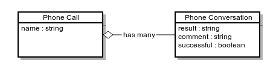
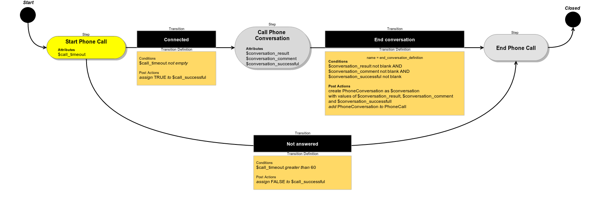

Configuration Reference
=======================

Table of Contents
-----------------
 - [Overview](#overview)
 - [Configuration File](#configuration-file)
 - [Configuration Loading](#configuration-loading)
 - [Defining a Workflow](#defining-a-workflow)
   - [Example](#example)
 - [Attributes Configuration](#attributes-configuration)
   - [Example](#example-1)
 - [Steps configuration](#steps-configuration)
   - [Example](#example-2)
 - [Transitions Configuration](#transitions-configuration)
   - [Example](#example-3)
 - [Transition Definition Configuration](#transition-definition-configuration)
   - [Example](#example-4)
 - [Conditions Configuration](#conditions-configuration)
   - [Example](#example-5)
 - [Post Actions](#post-actions)
   - [Example](#example-6)
 - [Example Workflow Configuration](#example-workflow-configuration)
   - [Configuration](#configuration)
   - [PhoneCall Entity](#phonecall-entity)
   - [PhoneConversation Entity](#phoneconversation-entity)
   - [Flow Diagram](#flow-diagram)

Overview
========

Configuration of Workfow declares all aspects related to specific workflow:

* basic properties of workflow like name and label
* steps and transitions
* attributes involved in workflow
* entities that are related to workflow

Structure of configuration is declared in class Oro\Bundle\WorkflowBundle\Configuration\WorkflowConfiguration.

Configuration File
==================

Configuration must be placed in a file named Resources/config/workflow.yml. For example
src/Acme/DemoWorkflowBundle/Resources/config/workflow.yml.


Configuration Loading
=====================

To load configuration execute a command

```
php app/console doctrine:fixtures:load --app/console doctrine:fixtures:load --append --fixtures=/path/to/bundles/WorkflowBundle/DataFixture
```

This command will save configuration from all workflow.yml files of loaded bundles into WorkflowDefinition entities.
It can be used in both cases when you want to load a new workflow or update existed one.

**Warning** *--append* options is crucial, if you skip it your database will be purged.

Workflow configuration cannot be merged, it means that you cannot override workflow that is defined in other bundle.
If you will declare a workflow and another bundle will declare it's own workflow with the same name the command will
trigger exception and data won't saved.

Defining a Workflow
===================

Root element of configuration is "workflows". Under this element workflows can be defined.

Single workflow configuration has next properties:

* **name**
    Workflow should have a unique name in scope of all application. As workflow configuration doesn't support merging
    two workflows with the same name will lead to exception during configuration loading.
* **label**
    *string*
    This value will be shown in the UI
* **enabled**
    *boolean (true - default)*
    If not enabled, operations with workflow will be be restricted.
* **type**
    *string ("wizard", "entity" - default)*
    type of workflow.
* **start_step**
    *string*
    The name of start step. It's optional if Workflow has start transition, otherwise start_step is required.
* **attributes**
    Contains configuration for Attributes
* **steps**
    Contains configuration for Steps
* **transitions**
    Contains configuration for Transitions
* **transition_definitions**
    Contains configuration for Transition Definitions

Example
-------
```
workflows:                        # Root elements
    phone_call:                   # A unique name of workflow
        label: Demo Call Workflow # This will be shown in UI
        enabled: true             # If not enabled, operations with workflow will be restricted.
        start_step: start_call    # name of start step
        attributes:               # configuration for Attributes
            # ...
        steps:                    # configuration for Steps
            # ...
        transitions:              # configuration for Transitions
            # ...
        transition_definitions:   # configuration for Transition Definitions here
            # ...
```

Attributes Configuration
========================

Workflow define configuration of attributes. When Workflow Item is created it can manipulate it's own data
(Workflow Data) that is mapped by Attributes. Each attribute must to have a type and may have options.
When Workflow Item is saved it's data is serialized according to configuration of attributes. Saving data that is
not mapped by any attribute or mismatched with attribute type is restricted.

Single attribute can be described with next configuration:

* **unique name***
    Workflow attributes should have unique name in scope of Workflow that they belong to.
    Step configuration references attributes by this value.
* **type**
    *string*
    Type of attribute. Next types are supported:
    * **boolean**
    * **bool**
        *alias for boolean*
    * **integer**
    * **int**
        *alias for integer*
    * **float**
    * **string**
    * **array**
        elements of array should be scalars or objects that supports serialize/deserialize
    * **object**
        object should support serialize/deserialize, option "class" is required for this type
    * **entity**
        Doctrine entity, option "class" is required and must be a class of Doctrine entity, also options
        "managed_entity", "bind" and "multiple" can be used
* **label**
    *string*
    Label can be shown in the UI
* **options**
    Options of this attribute. Currently next options are supported
    * **class**
        *string*
        Fully qualified class name. Allowed only when type either entity or object.
    * **managed_entity**
        *boolean*
        Allowed only when type is entity.
        If *true* than Workflow can be found by entity. It's useful when you need to give to user possibility to start
        Workflow that is applicable for specific entity.
    * **bind**
        *boolean*
        By default is *true* when *managed_entity* is *true*. Allowed only when type is entity. If true than instances of
        Workflow will be bound to entity that is saved in data as value of this attribute. It's useful when you need to
        find all Workflow Items that are connected with entity instance.
    * **multiple**
        *boolean (false - default)*
        By default is same as managed_entity value.
        If *true* than it will be possible to multiple instances of Workflow for this entity. If *false* than the
        restriction of one instance of Workflow for entity will be applied. Also false value is possible only if bind
        is true because of check relation between instances of Workflow and entity is possible only when bind is true.

**Notice**
Attribute configuration does not contain any information about how to render attribute on step forms,
it's responsibility of "Steps configuration". This make possible to render one attribute in different ways on steps.
Browse class *Oro\Bundle\WorkflowBundle\Model\AttributeAssembler* for more details.

Example
-------

```
workflows:
    phone_call:
        # ...
        attributes:
            phone_call:                  # unique attribute name
                label: Phone Call        # attribute label
                type: entity             # attribute type
                options:
                    class: Acme\Bundle\DemoWorkflowBundle\Entity\PhoneCall # entity class
                    managed_entity: true # this is a managed entity, so on page of PhoneCall user will be able to start this workflow
                    multiple: true       # many instances of workflow can be started for PhoneCall
                    bind: true           # all instances of workflow items can be found by PhoneCall instance
            call_timeout:
                type: integer
                label: 'Call Timeout'
            call_successfull:
                type: boolean
                label: 'Call Successful'
            conversation_successful:
                type: boolean
                label: 'Conversation Successful'
            conversation_comment:
                type: string
                label: 'Conversation Comment'
            conversation_result:
                type: string
                label: 'Conversation Result'
            conversation:
                type: entity
                label: 'Conversation'
                options:
                    class: Acme\Bundle\DemoWorkflowBundle\Entity\PhoneConversation
```

Steps configuration
===================

Steps are like nodes in graph of Workflow Transitions. Step must have a unique name and label and can optionally
contain form options, allowed transitions and other options. If Workflow has type wizard user will be able to see in
what step Workflow instance is at the moment, possible transitions and form of current step (if it is configured
via form options). Step can be connected with attributes via form options. On different step it is possible to attach
any attribute with any form options.

Summarizing all above, step has next configuration:

* **name**
    *string*
    Step must have unique name in scope of Workflow
* **label**
    *string*
    Label of step, can be shown in UI if Workflow has type wizard
* **template**
    *string*
    A custom Twig template that is used to render Worklflow in step in wizard page.
    By default template OroWorkflowBundle:WorkflowStep:edit.html.twig is used.
* **order**
    *integer*
    This value is used in wizard page to sort steps in UI.
* **is_final**
    *boolean*
    If true than workflow instance will be automatically closed after transition to this step will be performed.
* **form_type**
    *string (oro_workflow_step - default)*
    A form type that will be used to render form of step.
* **form_options**
    These options will be passed to form type of step, they can contain options for form types of attributes.
* **view_attributes**
    List of attributes that will be shown when step is selected on Workflow wizard UI. Custom path could be specified
    instead of name of attribute. Each view attribute could have "view_type" option which is used to find Twig block
    than will render value.
* **allowed_transitions**
    Optional list of allowed transitions. If no transitions are allowed it's same as is_final option set to true

Example
-------

```
workflows:
    phone_call:
        # ...
        steps:
            start_call:
                label: 'Start Phone Call'
                template: 'AcmeDemoWorkflowBundle:Workflow:phoneCall.html.twig' # custom template that will be rendered on wizard page for this step
                allowed_transitions:           # list of allowed transitions from this step
                    - connected
                    - not_answered
                form_type: oro_workflow_step   # used by default
                form_options:                  # options will be passed to step form type
                    attribute_fields:
                        call_timeout:          # must be a name of attribute that is configured in workflow
                            form_type: integer # this is a name of form type that will be added to step form to represent value of attribute
                            options:           # any options that should be applied to form type that represents attribute's value
                                required: true
                view_attributes:
                    - { path: $phone_call.number, label: "Phone number" } # render number property of phone_call attribute
            start_conversation:
                label: 'Call Phone Conversation'
                template: 'AcmeDemoWorkflowBundle:Workflow:phoneCall.html.twig'
                allowed_transitions:
                    - end_conversation
                form_options:
                    attribute_fields:
                        conversation_result:
                            form_type: text
                        conversation_comment:
                            form_type: text
                        conversation_successful:
                            form_type: choice
                            options:
                                choices: {1: 'Yes', 0: 'No'}
                                required: true
                                multiple: false
                view_attributes:
                    - call_timeout # render call_timeout attribute
            end_call:
                label: 'End Phone Call'
                template: 'AcmeDemoWorkflowBundle:Workflow:phoneCall.html.twig'
                is_final: true
                view_attributes:
                    - { attribute: conversation_result, view_type: custom } # render conversation_result attribute using custom block
```

Transitions Configuration
=========================

Transitions changes current step of Workflow Item when it's performed. It also uses Transition Definition to check if
it's allowed and to perform Post Actions.

Transition configuration has next options:

* **unique name***
    *string*
    A transition must have unique name in scope of Workflow. Step configuration references transitions by this value.
* **step_to***
    *string*
    Next step name. This is a reference to step that will be set to Workflow Item after transition is performed.
* **transition_definition***
    A references to Transition Definition configuration
* **is_start**
    *boolean*
    If true than this transition can be used to start new workflow. At least one start transition is required if
    workflow doesn't have start_step attribute.
* **form_type**
    *string (oro_workflow_attributes - default)*
    A form type that will be used to render form of transition.
* **frontend_options**
    Can have such frontend options as **class** (a CSS class applied to transition button), **icon**
    (CSS class of icon of transition button).
* **form_options**
    These options will be passed to form type of transition, they can contain options for form types of attributes that
    will be shown when user clicks transition button.

Example
-------

```
workflows:
    phone_call:
        # ...
        transitions:
            connected:                                      # Unique name of transition
                label: 'Connected'                          # Label can be used in UI
                step_to: start_conversation                 # The name of next step that will be set to Workflow Item
                                                            # when transition will be performed

                transition_definition: connected_definition # A reference to Transition Definition configuration
                frontend_options:
                    icon: 'icon-ok'                         # add icon to transition button with class "icon-ok"
                    class: 'btn-primary'                    # add css class "btn-primary" to transition button
                form_options:
                    attribute_fields:                       # fields of form that will be shown when transition button is clicked
                        call_timeout:
                            form_type: integer
                            options:
                                required: false
            not_answered:
                label: "Not answered"
                step_to: end_call
                transition_definition: not_answered_definition
            end_conversation:
                label: 'End conversation'
                step_to: end_call
                transition_definition: end_conversation_definition
```

Transition Definition Configuration
===================================

Transition Definition is used by Transition to check Conditions and to perform Init Action and Post Actions.

Transition definition configuration has next options.

* **conditions**
    Configuration of Conditions that must satisfy to allow transition
* **post_actions**
    Configuration of Post Actions that must be performed after transit to next step will be performed.
* **init_actions**
    Configuration of Init Actions that may be performed on workflow item before conditions and post actions.

Example
-------

```
workflows:
    phone_call:
        # ...
        transition_definitions:
            connected_definition: # Try to make call connected
                # Check that timeout is set
                conditions:
                    @not_blank: [$call_timeout]
                # Set call_successfull = true
                post_actions:
                    - @assign_value: [$call_successfull, true]
                init_actions:
                    - @increment_value: [$call_attempt]
            not_answered_definition: # Callee did not answer
                # Make sure that caller waited at least 60 seconds
                conditions: # call_timeout not empty and >= 60
                    @and:
                        - @not_blank: [$call_timeout]
                        - @ge: [$call_timeout, 60]
                # Set call_successfull = false
                post_actions:
                    - @assign_value: [$call_successfull, false]
            end_conversation_definition:
                conditions:
                    # Check required properties are set
                    @and:
                        - @not_blank: [$conversation_result]
                        - @not_blank: [$conversation_comment]
                        - @not_blank: [$conversation_successful]
                # Create PhoneConversation and set it's properties
                # Pass data from workflow to conversation
                post_actions:
                    - @create_entity: # create PhoneConversation
                        class: Acme\Bundle\DemoWorkflowBundle\Entity\PhoneConversation
                        attribute: $conversation
                        data:
                            result: $conversation_result
                            comment: $conversation_comment
                            successful: $conversation_successful
                            call: $phone_call
```

Conditions Configuration
========================

Conditions configuration is a part of Transition Definition Configuration. It declares a tree structure of conditions
that are applied on the Workflow Item to check is the Transition could be performed. Single condition configuration
contains alias - a unique name of condition and options.

Optionally each condition can have a constraint message. All messages of not passed conditions will be shown to user
when transition could not be performed.

There are two types of conditions - preconditions and actually transit conditions. Preconditions is used to check
whether transition should be allowed to start, and actual conditions used to check whether transition can be done.
Good example of usage is transition forms: preconditions are restrictions to show button that open transition
form dialog, and actual transitions are used to validate form content after submitting.

Alias of condition starts from "@" symbol and must refer to registered condition. For example "@or" refers to logical
OR condition.

Options can refer to values of Workflow Data using "$" prefix. For example "$call_timeout" refers to value of
"call_timeout" attribute of Workflow Item that is processed in condition.

Also it is possible to refer to any property of Workflow Item using "$." prefix. For example to refer date time when
Workflow Item was created a string "$.created" can be used.

Example
-------

```
workflows:
    phone_call:
        # ...
        transition_definitions:
            # some transition definition
            qualify_call:
                pre_conditions:
                    @equal: [$status, "in_progress"]
                conditions:
                    # empty($call_timeout) || (($call_timeout >= 60 && $call_timeout < 100) || ($call_timeout > 0 && $call_timeout <= 30))
                    @or:
                        - @blank: [$call_timeout]
                        - @or:
                            - @and:
                                message: Call timeout must be between 60 and 100
                                parameters:
                                    - @greater_or_equal: [$call_timeout, 60]
                                    - @less: [$call_timeout, 100]
                            - @and:
                                message: Call timeout must be between 0 and 30
                                parameters:
                                    - @less_or_equal: [$call_timeout, 30]
                                    - @greater: [$call_timeout, 0]
```

Post Actions and Init Action
============================

Post Actions and Init Action configuration complements Transition Definition configuration.

Post Actions will be performed during transition AFTER conditions will be qualified and current Step of Workflow Item
will be changed to the corresponding one (step_to option) in the Transition.

Init Actions may be performed before transition. One of possible init actions usage scenario is to fill Workflow
Item with default values, which will be used by Transition form if it any exist.

Action configuration consists from alias of Action (which is a unique name of Action) and options
(if such are required).

Similarly to Conditions alias of Action starts from "@" symbol and must refer to registered Action. For example
"@create_entity" refers to Action which creates entity.

Example
-------

```
workflows:
    phone_call:
        # ...
        transition_definitions:
            # some transition definition
                init_actions:
                    - @assign_value: [$call_attempt, 1]
                post_actions:
                    - @create_entity: # create an entity PhoneConversation
                        class: Acme\Bundle\DemoWorkflowBundle\Entity\PhoneConversation
                        attribute: $conversation
                        data: # Fill values of freshly created PhoneConversation with data from current WorkflowItem
                            result: $conversation_result
                            comment: $conversation_comment
                            successful: $conversation_successful
                            call: $phone_call
```

Example Workflow Configuration
==============================

In this example configuration of Workflow there are two entities:

* Phone Call
* Phone Conversation



When Workflow Item is created it's connected to Phone Call. On the first step "Start Call" user can go to
"Call Phone Conversation Step" if a callee answered or to "End Phone Call" step if callee didn't answer.
On the step "Call Phone Conversation" User enter Worfklow Data and go to "End Phone Call" step via "End conversation"
transition. On this transition a new Entity of Phone Conversation is created and assigned to Phone Call entity.

Configuration
-------------

```
workflows:
    phone_call:
        label: 'Demo Call Workflow'
        enabled: true
        type: wizard
        start_step: start_call
        steps:
            start_call:
                label: 'Start Phone Call'
                template: 'AcmeDemoWorkflowBundle:Workflow:phoneCall.html.twig'
                allowed_transitions:
                    - connected
                    - not_answered
                form_options:
                    attribute_fields:
                        call_timeout:
                            form_type: integer
                            options:
                                required: true
                view_attributes:
                    - { path: $phone_call.number, label: "Phone number" } # render number property of phone_call attribute
            start_conversation:
                label: 'Call Phone Conversation'
                template: 'AcmeDemoWorkflowBundle:Workflow:phoneCall.html.twig'
                allowed_transitions:
                    - end_conversation
                form_options:
                    attribute_fields:
                        conversation_result:
                            form_type: text
                        conversation_comment:
                            form_type: text
                        conversation_successful:
                            form_type: choice
                            options:
                                choices: {1: 'Yes', 0: 'No'}
                                required: true
                                multiple: false
                view_attributes:
                    - call_timeout # render call_timeout attribute
            end_call:
                label: 'End Phone Call'
                template: 'AcmeDemoWorkflowBundle:Workflow:phoneCall.html.twig'
                is_final: true
                view_attributes:
                    - { attribute: conversation_result, view_type: custom } # render conversation_result attribute using custom block
        attributes:
            phone_call:
                label: Phone Call
                type: entity
                options:
                    class: Acme\Bundle\DemoWorkflowBundle\Entity\PhoneCall
                    managed_entity: true
                    multiple: true
            call_timeout:
                type: integer
                label: 'Call Timeout'
            call_successfull:
                type: boolean
                label: 'Call Successful'
            conversation_successful:
                type: boolean
                label: 'Conversation Successful'
            conversation_comment:
                type: string
                label: 'Conversation Comment'
            conversation_result:
                type: string
                label: 'Conversation Result'
            conversation:
                type: entity
                label: 'Conversation'
                options:
                    class: Acme\Bundle\DemoWorkflowBundle\Entity\PhoneConversation
        transitions:
            connected:
                label: 'Connected'
                step_to: start_conversation
                transition_definition: connected_definition
                frontend_options:
                    icon: 'icon-ok'                         # add icon to transition button with class "icon-ok"
                    class: 'btn-primary'                    # add css class "btn-primary" to transition button
                form_options:
                    attribute_fields:                       # fields of form that will be shown when transition button is clicked
                        call_timeout:
                            form_type: integer
                            options:
                                required: false
            not_answered:
                label: "Not answered"
                step_to: end_call
                transition_definition: not_answered_definition
            end_conversation:
                label: 'End conversation'
                step_to: end_call
                transition_definition: end_conversation_definition
        transition_definitions:
            connected_definition: # Try to make call connected
                # Check that timeout is set
                conditions:
                    @not_blank: [$call_timeout]
                # Set call_successfull = true
                post_actions:
                    - @assign_value: [$call_successfull, true]
                init_actions:
                    - @increment_value: [$call_attempt]
            not_answered_definition: # Callee did not answer
                # Make sure that caller waited at least 60 seconds
                conditions: # call_timeout not empty and >= 60
                    @and:
                        - @not_blank: [$call_timeout]
                        - @ge: [$call_timeout, 60]
                # Set call_successfull = false
                post_actions:
                    - @assign_value: [$call_successfull, false]
            end_conversation_definition:
                conditions:
                    # Check required properties are set
                    @and:
                        - @not_blank: [$conversation_result]
                        - @not_blank: [$conversation_comment]
                        - @not_blank: [$conversation_successful]
                # Create PhoneConversation and set it's properties
                # Pass data from workflow to conversation
                post_actions:
                    - @create_entity: # create PhoneConversation
                        class: Acme\Bundle\DemoWorkflowBundle\Entity\PhoneConversation
                        attribute: $conversation
                        data:
                            result: $conversation_result
                            comment: $conversation_comment
                            successful: $conversation_successful
                            call: $phone_call
```

PhoneCall Entity
----------------
```
<?php

namespace Acme\Bundle\DemoWorkflowBundle\Entity;

use Doctrine\Common\Collections\ArrayCollection;
use Doctrine\ORM\Mapping as ORM;

/**
 * @ORM\Table(name="acme_demo_workflow_phone_call")
 * @ORM\Entity
 */
class PhoneCall
{
    /**
     * @ORM\Column(name="id", type="integer")
     * @ORM\Id
     * @ORM\GeneratedValue(strategy="AUTO")
     */
    private $id;

    /**
     * @ORM\Column(name="number", type="string", length=255)
     */
    private $number;

    /**
     * @ORM\Column(name="name", type="string", length=255, nullable=true)
     */
    private $name;

    /**
     * @ORM\Column(name="description", type="text", nullable=true)
     */
    private $description;

    /**
     * @ORM\OneToMany(targetEntity="PhoneConversation", mappedBy="call")
     **/
    private $conversations;

    public function __construct()
    {
        $this->conversations = new ArrayCollection();
    }

    public function getId()
    {
        return $this->id;
    }

    public function setNumber($number)
    {
        $this->number = $number;
        return $this;
    }

    public function getNumber()
    {
        return $this->number;
    }

    public function setName($name)
    {
        $this->name = $name;
        return $this;
    }

    public function getName()
    {
        return $this->name;
    }

    public function setDescription($description)
    {
        $this->description = $description;

        return $this;
    }

    public function getDescription()
    {
        return $this->description;
    }

    public function getConversations()
    {
        return $this->conversations;
    }
}
```

PhoneConversation Entity
------------------------
```
<?php

namespace Acme\Bundle\DemoWorkflowBundle\Entity;

use Doctrine\ORM\Mapping as ORM;

/**
 * @ORM\Table(name="acme_demo_workflow_phone_conversation")
 * @ORM\Entity
 */
class PhoneConversation
{
    /**
     * @ORM\Column(name="id", type="integer")
     * @ORM\Id
     * @ORM\GeneratedValue(strategy="AUTO")
     */
    private $id;

    /**
     * @ORM\ManyToOne(targetEntity="PhoneCall", inversedBy="conversations")
     * @ORM\JoinColumn(name="call_id", referencedColumnName="id")
     */
    private $call;

    /**
     * @ORM\Column(name="result", type="string", length=255, nullable=true)
     */
    private $result;

    /**
     * @ORM\Column(name="comment", type="string", length=255, nullable=true)
     */
    private $comment;

    /**
     * @ORM\Column(name="successful", type="boolean", nullable=true)
     */
    private $successful;

    public function getId()
    {
        return $this->id;
    }

    public function setResult($result)
    {
        $this->result = $result;

        return $this;
    }

    public function getResult()
    {
        return $this->result;
    }

    public function setComment($comment)
    {
        $this->comment = $comment;
        return $this;
    }

    public function getComment()
    {
        return $this->comment;
    }

    public function setSuccessful($successful)
    {
        $this->successful = $successful;
        return $this;
    }

    public function isSuccessful()
    {
        return $this->successful;
    }

    public function setCall($call)
    {
        $this->call = $call;
        return $this;
    }

    public function getCall()
    {
        return $this->call;
    }
}
```

Flow Diagram
------------


