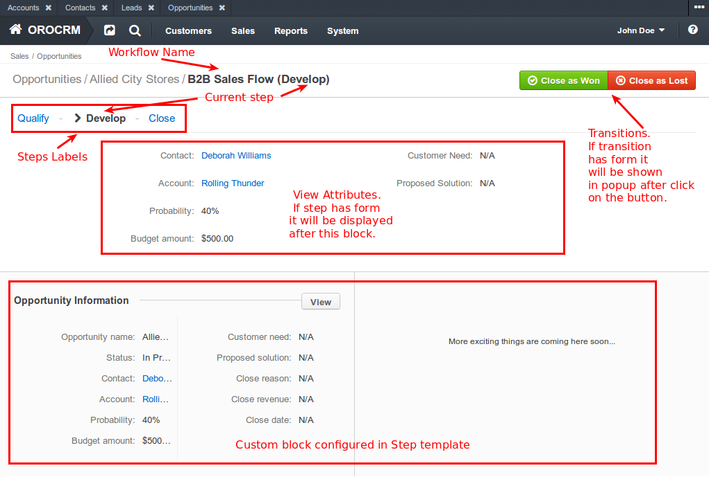
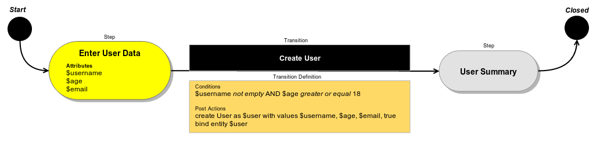

Getting Started
===============

Table of Contents
-----------------
 - [What is Workflow?](#what-is-workflow)
 - [Main Entities](#main-entities)
 - [Entity and Wizard Workflows?](#entity-and-wizard-workflows)
 - [How it works?](#how-it-works)
 - [Managed Entities](#managed-entities)
 - [Bind Entities](#bind-entities)
 - [Configuration](#configuration)

What is Workflow?
=================

Workflow is a complex solution that allows user to perform set of actions with predefined conditions - each next action
depends on previous. Also Workflow can be described as some kind of wizard that helps user to perform complex actions.
Usually Workflow is used to manage some specific entity and to create additional related entities.

Main Entities
=============

Workflow consists of several related entities.

* **Step** - entity that shows current state of Workflow. It can have form, attributes to display, allowed transitions
that will be rendered as a buttons when step is displayed, name, label and template and some other additional
parameters.

* **Attribute** - entity that represent a value in Workflow Item. Attribute consists of name, label, attribute type
(string, object, entity etc.) and additional options depending on type (for example "class" when type is "object").

* **Transition** - action that change current step of Workflow Item (i.e. moves it from one step to another). Transition
is allowed if it's Conditions are satisfied. Before Transition performed Init Actions are executed and after
transition performed - Post Actions are executed. Transition can be used as a start transition - it means that this
transition will start Workflow and create new instance of Workflow Item. Transition optionally could have a form. In
this case this form will be showed to user when Transition button is clicked. Transition contains name, label and some
additional options.

* **Condition** - defines whether specific Transition is allowed with specified input data. Conditions can be nested.

* **Actions** - actions are assigned to Transition and executed when Transition performed. There are two kind of actions:
Init Action and Post Actions. The difference between them is that Init Actions are executed before Transition and
Post Actions are executed after Transition. Actions can be used to manage entities (create, find), manipulate attributes
(assign values) and to perform any other actions.

* **Workflow** - aggregates steps, attributes and transitions. Workflow is a model that doesn't have own state but it
can have instances as Workflow Items.

* **Workflow Data** - aggregated by Workflow Item. Each value associated with Attribute.
Those values can be entered by user directly or assigned via Actions.

* **Workflow Item** - associated with Workflow and indirectly associated with Steps, Transitions and
Attributes. Has it's own state in Workflow Data, current Step name, list of bound entities and other data.

Entity and Wizard Workflows
===========================

There are two types of Workflows:
* wizard;
* entity (default).

**Wizard Workflow**

When user starts wizard Workflow then he will be redirected to special Workflow page. On this page he can see next
UI blocks:
* list of steps labels as links
* optional area with form of step
* optional area with view attributes of step
* all other steps and their forms in read only mode
* buttons with possible transitions
* custom blocks configured by developer (for example information block with some entity data)



**Entity Workflow**

Unlike wizard, entity Workflow doesn't have special page and it's directly managed on entity page. Another difference
from wizard Workflow is that steps of entity Workflow cannot have forms and user performs transitions on managed entity
page by clicking on Workflow buttons.

How it works?
=============

When user clicks button with start transition (and submit transition form if it's exist) in the background
a new instance of Workflow Item of specific Workflow is created.

Each Step has a list of allowed Transitions, and each Transition has list of Conditions that define whether this
Transition can be performed with specific Workflow Item state. If Transition is allowed then user can perform it.
If Transition has Init Actions they are executed before Transition. If transition has Post Actions then
these Post Actions will be performed right after Transition. So, user can move through Steps of Workflow until
he reach the final Step where Workflow will be finished and Workflow Item will be marked as closed.
It's also possible that Workflow doesn't have a final step. In this case user can perform transitions until they are
allowed.

Workflow Item stores all collected data and current step, so, user can stop his progress on Workflow at any moment and
then return to it, and Workflow will have exactly the same state.

Managed Entities
================

Workflow can have attributes with managed entities. Values of such attributes are required. When user visits page of
some entity, this knowledge can be used to show all applicable Workflows that can be started.

When Workflow has managed entity attribute it means that the data of Workflow Item contains a reference to that entity.
If for some reason managed entity will be deleted Workflow Item won't be applicable.

Bind Entities
=============

When Workflow has attributes with bind entities this information can be used to show all bound Workflows Items on page
of the entity. Managed entities attributes are bound by default.

Configuration
=============

All Workflow entities are described in configuration. Look at example of simple Workflow configuration that creates a
new user.

```
workflows:
    create_user:                             # name of the workflow
        label: 'Create User Workflow'        # workflow label
        start_step: create_user_form         # step that will be shown first
        enabled: true                        # is this workflow enabled, default true
        type: wizard                         # type of workflow (entity|wizard), default entity
        steps:                               # list of all existing steps in workflow
            user_form:                       # step where user should fill form with personal information
                label: 'Enter User Data'                               # step label
                template: AcmeDemoBundle:User:userForm.html.twig       # step template, default is OroWorkflowBundle:WorkflowStep:edit
                form_options:                # options of form type for rendering attributes
                    attribute_fields:
                        username:            # field for username attribute
                            form_type: text
                            options:         # options of form type
                                required: true
                                max_length: 20
                        age:                 # field for age attribute
                            form_type: integer
                            options:
                                required: true
                        email:               # field for email attribute
                            form_type: email
                            options:
                                required: false
                                label: User Email # custom label, override attribute label
                allowed_transitions:         # list of allowed transition from this step
                    - create_user            # user can be created from this step
            user_summary:                    # step where user can review entered data
                label: 'User Summary'                                  # step label
                template: AcmeDemoBundle:User:userSummary.html.twig    # custom step template
                is_final: true                                         # this step is final
        attributes:                          # list of all existing attributes in workflow
            username:                        # username attribute
                label: 'Username'            # attribute label
                type: string                 # attribute type, possible values are bool (boolean), int (integer), float, string, array, object, entity
            age:                             # age attribute
                label: 'Age'
                type: integer
            email:                           # email attribute
                type: string
                label: 'Email'
            user:                            # user entity
                type: entity
                label: 'User'
                options:                     # attribute options
                    class: Acme\Bundle\DemoBundle\Entity\User    # entity class name
                    bind: true               # make possible to find bound Workflow Items by entity
        transitions:                         # list of all existing transitions in workflow
            create_user:                     # transition from step "user_form" to "user_summary"
                label: 'Create User'                             # transition label
                step_to: user_summary                            # next step after transition performing
                transition_definition: create_user_definition    # link to definition of conditions and post actions
        transition_definitions:              # list of all existing transition definitions
            create_user_definition:          # definitions for transition "create_user"
                conditions:                  # required conditions: username is not empty and age >= 18
                    @and:                                        # AND for all children conditions
                        - @not_empty: [$username]                # username attribute value is not empty
                        - @greater_or_equal: [$age, 18]          # age attribute value is greater or equal to 18
                post_actions:                # required post actions: create User entity
                    - @create_entity:        # create entity post action
                        parameters:          # parameters of post action
                            class: Acme\Bundle\DemoBundle\Entity\User    # entity class name
                            attribute: $user                             # save entity in attribute "user"
                            data:                                # user entity data
                                username: $username              # get username value from attribute "username"
                                age: $age                        # get age value from attribute "age"
                                email: $email                    # get email value from attribute "email"
                                registered: true                 # set registered flag as true
```

This configuration describes Workflow that includes two steps - "user_form" and "user_summary".

At step "user_form" user should fill small form with personal information attributes - "username" as text (required),
"age" as integer (required) and "email" as email (optional).

To perform transition "create_user" several conditions must be satisfied (transition definition
"create_user_definition", node "conditions"): user must enter username (condition @not_empty) and (condition @and) age
must be greater of equals to 18 years (condition @greater_or_equal). If these conditions and satisfied following post
actions will be performed (transition definition "create_user_definition", node "post_actions"): User entity will be
created with entered data and it will be saved to attribute "user" (post action @create_entity).

Following diagram shows this schema in graphical representation.


