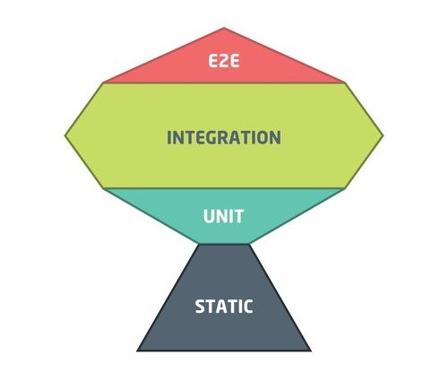

Catalogs - tests
================

## Requirements

Your PIM is running in **test** mode using docker.
```shell
make dependencies pim-test
```

## Getting started

To launch all the tests, execute the following command: 
```shell
make catalogs-tests
```

If you want to run only a part of the tests, checkout the content of 
`catalogs-tests` in the [Makefile](../Makefile) to find the commands.

## Strategy

Catalogs is following the trophy strategy for the tests, both in the frontend and in the backend.



### Static

With strong typing in the code, we catch obvious typos and errors without having to write tests for everything.  
Static rules are strict on purpose.

### Unit

We verify that individual parts work as expected.  
*Examples:*
- *unit test a Symfony validator*
- *unit test a React hook*

Even if they are fast to execute, unit tests are effective only if you are testing the result of the unit of code, not the implementation.  
You should always be able to refactor the code without updating the test if its purpose does not change.  
Asserting that some method call other services slow us down when we need to refactor.

You are **not expected** to have 100% coverage with unit tests.

### Integration

We verify that several units of code work together.  
It can involve either multiple classes or multiple services over the network.   
*Examples:*
- *integration test on a SQL query*
- *integration test on a Symfony controller response*
- *integration test on the DOM generated by a React component*

Same as unit tests, you should always be able to refactor the code without updating the test if its purpose does not change.  

You are **not expected** to have 100% coverage with integration tests.
But you are **expected** to write them to cover critical parts of the application.

### End to end

As of today, there has been no decision regarding how to write E2E tests in Catalogs.
