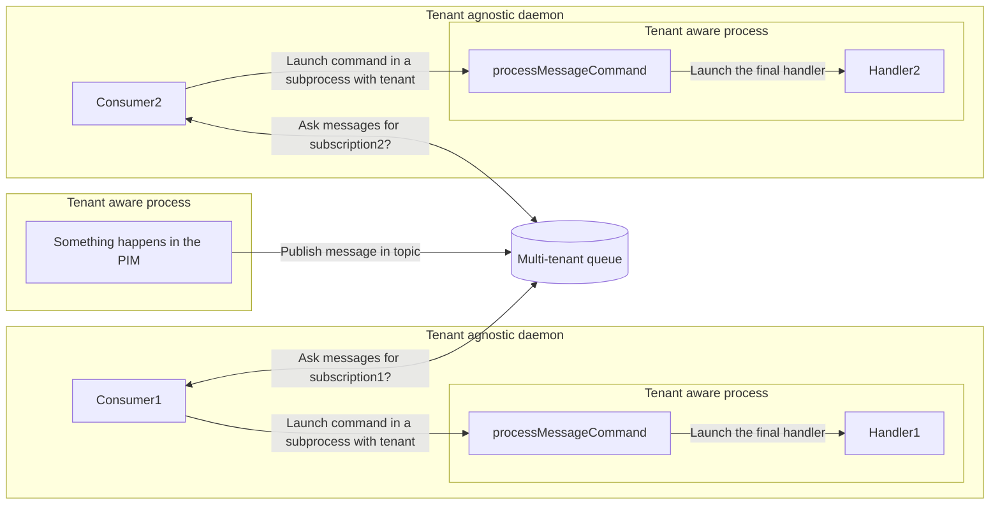

# Messaging

## Presentation

The goal of this component is to facilitate the set up of queues and consumers.

The component uses Symfony Messenger to configure the queue according to the environment

| Env        | Transport         |
|------------|-------------------|
| dev        | doctrine          |
| test       | PubSub            |
| test_fake  | In Memory         |
| behat      | PubSub            |
| prod       | doctrine / PubSub |

## How it works

## Documentation

- [How to add a queue?](docs/how-to-add-a-queue.md)
