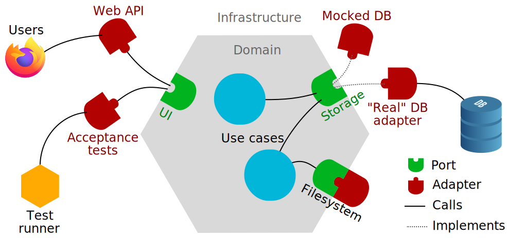
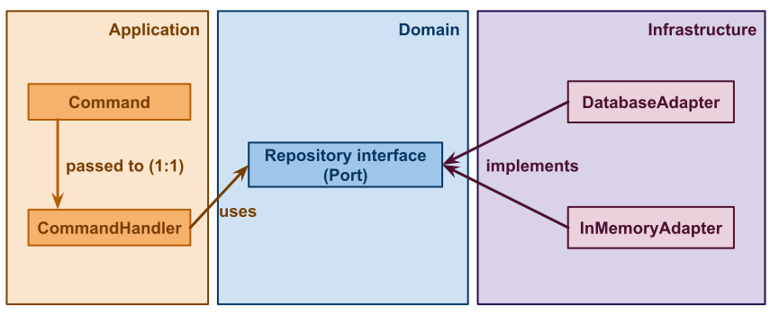
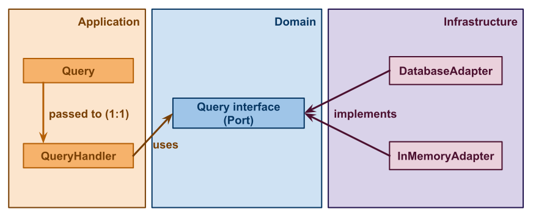

# Backend architecture

The architecture of the application is mainly inspired from Hexagonal, CQRS architecture and DDD.
Caution: we did not implement these architectures by the book, but we took what was really interesting for us.

## Hexagonal architecture

The hexagonal architecture is based on two main principles :

- Explicitly separating Domain (pure side) and Infrastructure (impure side),
- Dependencies are going from Infrastructure to the Domain.



To learn more about hexagonal architecture, please refer to [this set of articles](https://jmgarridopaz.github.io/content/hexagonalarchitecture.html).

### Domain

It contains all the code that concerns and implements business logic. The domain contains the business vocabulary and the pure business logic, which relates to the concrete problem solved by the application.

### Infrastructure

This is where the application needs are listed, what it requires to work. It contains essential infrastructure details such as the code that interacts with the database, makes calls to the file system, or handles HTTP calls to other applications on which it depends, for example.

### Application 

Sometimes referred to as "Workflow Services" or "User Cases", these services orchestrate the steps required to fulfill the commands imposed by the client. The application is never called by the Domain, only by the Infrastructure.

### Port / adapter

#### Port
Each group of interactions with a given purpose/intention is a port. Infrastructure applications can only interact through the hexagon ports, they shouldn’t be able to access the hexagon directly. Ports are interfaces implemented by the adapters to apply the dependency inversion principle. This way, coupling is always made from inner to outer layers.

#### Adapter 
Infrastructure applications interact with hexagon ports through adapters using a specific technology. An adapter is a software component that allows a technology to interact with a port of the hexagon. Adapters depend on ports (interfaces) in compliance with the dependency inversion principle.

## CQRS

CQRS stands for Command Query Responsibility Segregation. At its heart the notion is that a model or a service has only one responsibility (reading or writing, not both).

## DDD

DDD does not only apply to the code, it’s a way to go through all the processes, from the first brainstorming session to the final product. It puts the domain at the center of the product. Hexagonal architecture is one of the tools used in DDD, like ubiquitous language (language defined together by the tech team and business experts to talk about the domain).

## What is interesting in these architectures?

* Separate Domain (pure side) and Infrastructure (impure side).
* Adapters are pretty useful to delay technical choices and let the team work on the front and the back part at the same time.
* Having several simple, optimizable models instead of a big one.

## Code organization

### Domain

**Caution** Every piece of code contained in the domain **must not** depend on filesystem, IO, time, or infrastructure.

#### Write side


(source : https://docs.google.com/drawings/d/1O7UgZb3nekvaJKIHD3YcMWrJmPsv2wDeqyJtxZx37lQ/edit?usp=sharing)

```
$ tree back/src/Domain/Supplier/Write
├── Supplier.php     # Aggregate
├── Repository.php   # Interface
└── ...
```

The folder `Write` **must** be organized depending on business concept (aggregate name for example). The folder should contain at least:
* the aggregates (entities, value objects, etc.)
* all contracts (interfaces)

#### Read Site


(source : https://docs.google.com/drawings/d/1BcFPgpu0sZF6O7yNbYfy_CM-gVS-wtsWNtlI-qR7F58/edit?usp=sharing)
```
$ tree back/src/Domain/ProductFileDropping/Read
├── SupplierFile.php                # Aggregate
├── DowloadStoredProductFile.php   # Query Interface
└── ...
```

The folder `Read` **must** be organized depending on business concept (aggregate name for example). The folder should contain at least:
* the aggregates (entities, value objects, etc.)
* all contracts (interfaces)


### Application

Query and commands are DTO (data transfer object).

The folder `Application` contains commands, command handlers, query and query handlers. In this folder read side and write side aren't separate. Query and command are easily recognized by their names.

```
$ tree back/src/Application
├── Supplier
│   ├── CreateSupplierHandler.php   # Command handler
│   ├── CreateSupplier.php          # Command
│   └── ...
├── ProductFileDropping
│   ├── DowloadProductFileHandler.php   # Query handler
│   ├── DowloadProductFile.php          # Query
│   └── ...
├── ...
```

The folder `Application` also contains subscribers. They listen and react to events (sent between contexts or from other applications).

```
$ tree back/src/Application/ProductFileDropping
├── Subsriber
│   ├── NotifyUsersOnSupplierFileAdded.php   # Event listener
│   └── ...
├── ...
```

### Infrastructure

The folder `Infrastructure` gathers every piece of code needed to interact with the outside world (UI, CLI, database, filesystem, API, framework configuration...).

The rest of the code should be organized first by bounded context, then by technical role.

#### Folder organization

```
back/src/Infrastructure/Supplier
├── Controller                       
│   ├── SupplierCreate.php           # Adapter
│   └── ...
├── Query
│   ├── InMemoryGetSupplierList.php  # Adapter
│   ├── DatabaseGetSupplierList.php  # Adapter
│   └── ...
├── Repository
│   ├── InMemoryRepository.php       # Adapter
│   ├── DatabaseRepository.php       # Adapter
│   └── ...
└── ...
```

The `Query` folder gathers everything related to queries.
The `Repository` folder gathers everything related to data storage like repositories.
The `Controller` folder gathers everything related to user end point. It could be from a supplier's, retailer's, developers or system's point of view.


