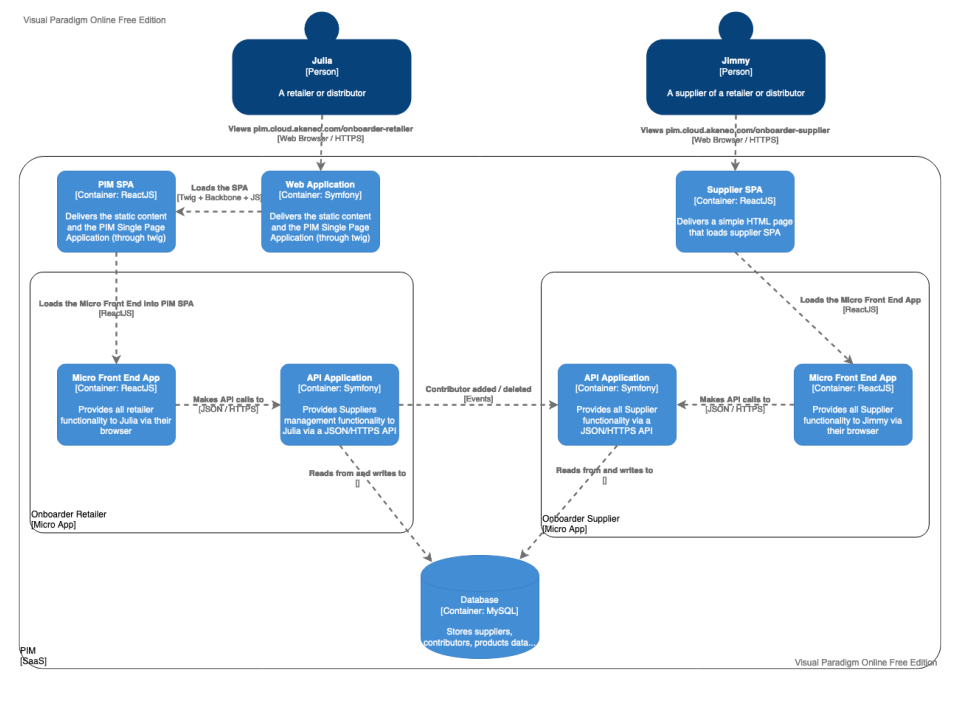
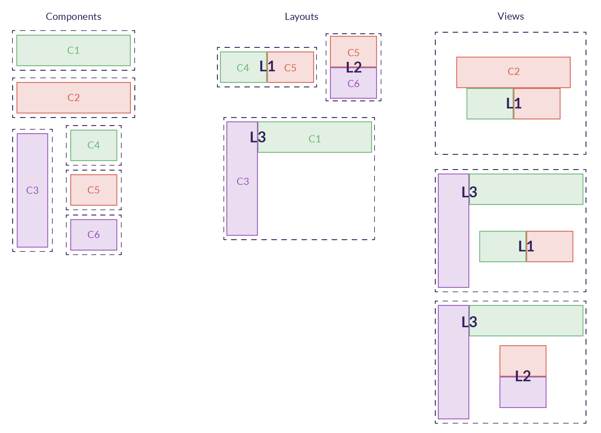

# Frontend architecture

Supplier Portal is composed of two apps : the supplier one and the retailer one. Both are integrated into the PIM in the `components/` directory.
Each app has a different front architecture imposed by the PIM front's legacy.



## Supplier

Supplier front is only built with React, components, layouts, views and micro-frontend principles. It's based on React components and not class-based.

### React : Components Architecture

**Components** are the smallest graphical entities possible like buttons or inputs. One component has its own design and could be reused anywhere in the application. Akeneo as his own [library of components: Storybook](https://dsm.akeneo.com/?path=/story/introduction--page).

**Layouts** can be built with a set of components or with other layouts. They can only be used in a view or other layouts.

**Views** can be built with a set of layouts and components.



### Micro-frontend

Micro frontend splits the code in smaller frontend apps in order to make it easier to code, test and maintain.
Our frontend code is split by pages.

#### Composition

Micro frontends are composed of:
- Components
- hooks (to extract side effects from components)
- API calls (to the backend to send or receive information)
- models

## Retailer

### PIM legacy

Originally the PIM’s front was built with the [Backbone](https://backbonejs.org/) framework. With javascript technology evolving quickly, we are now working with the [React](https://reactjs.org/) framework. However, there is still some backbone legacy parts in the PIM, so new React interfaces need to be booted by a Backbone controller.

#### Booting React with Backbone

In the PIM, menus are coded with Backbone, but the main view is React-based. A React component is called from the PIM by a Backbone controller.


```
$ tree back/src/infrastructure/Symfony/Resources/config
├── form_extensions.yml     # Backbone controller
├── requirejs.yml           # Link between controllers
└── ...
```
```
pim-menu-connect-supplier-portal-supplier-list:
  module: pim/menu/item
  parent: pim-menu-connect-supplier-portal-block
  config:
      title: supplier_portal.supplier.supplier_list.menu_item
      to: supplier_portal_retailer_supplier_list
```
“module”: the component

“parent”: the component’s parent

“to”: Backbone route activated on click of the element

The route leads to the `requirejs.yml` file which connects Backbone controllers with React controllers. These connections lead to a `.tsx` controller (react).

```
$ tree back/src/infrastructure/Symfony/Ressouces/public/js/controller
├── suplier-management.tsx     # React controller
└── ...
```

### React

React frontend and micro frontend is similar to the supplier app.

## Note

Both supplier and retailer apps are designed to be [i18n compatible](https://www.i18next.com/), but it's not yet functional.


