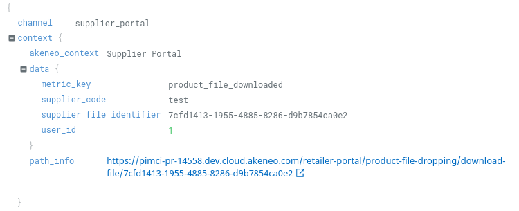

# Success metrics

We want to monitor the usage of our features. To do so, during PDRs, we are defining success metrics for each of our new features.
Those success metrics are based on application logs.

## Application logs

When we need data to compute a success metric, we add a `metric_key` key in the context of our log as follows:

We're logging in the context argument of every Monolog logging function. [See here](./logging.md) for more information about how and what
we log in the Supplier Portal.

## Monitoring with Datadog

### Custom metrics

Once application logs are implemented, we define custom metrics in Datadog. 
Supplier Portal custom metrics start with `akeneo.sp.`, they are defined [here](https://app.datadoghq.eu/logs/pipelines/generate-metrics).

### Dashboard

Once custom metrics are defined, we compute our success metrics based on them. 
The success metrics are gathered on [this Datadog dashboard](https://app.datadoghq.eu/dashboard/8dv-mdc-3yz/supplier-portal---success-metrics?from_ts=1658066149598&to_ts=1660744549598&live=true).
