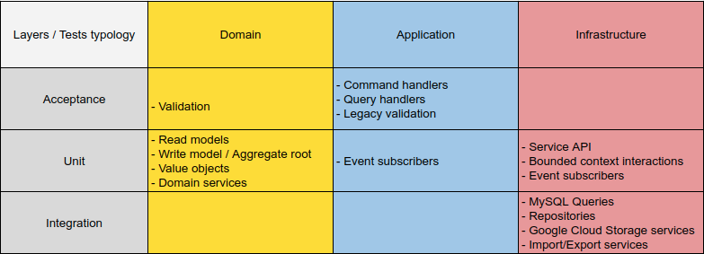
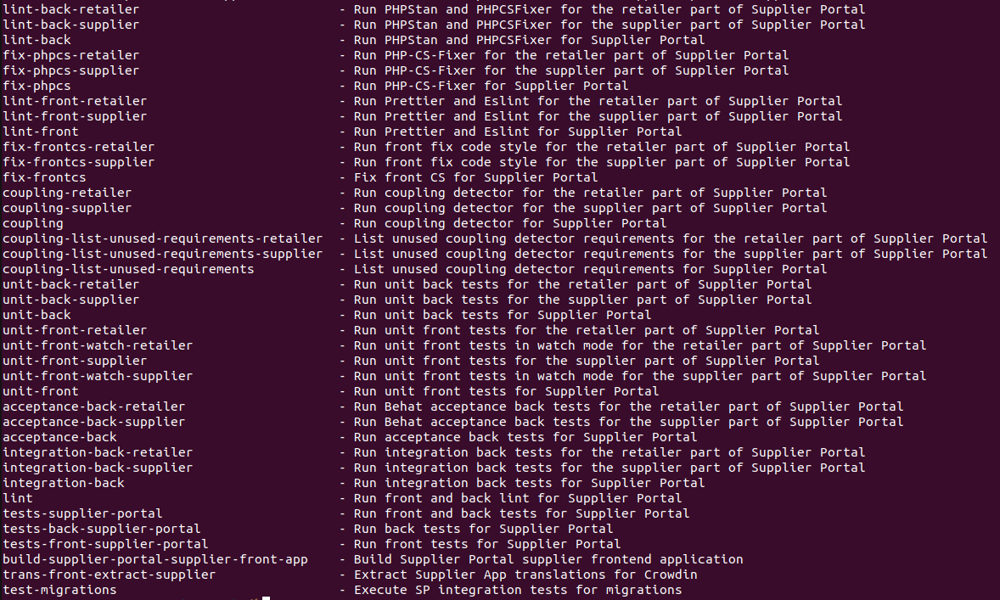

# Tests

## Introduction

You will find in this document some information about testing practices in the Supplier Portal.

First thing first, we're considering that the most important part of our app is the Domain, so we're focusing our efforts 
on testing the Domain.

- The Domain is tested both in acceptance and unit.
- The Application is tested both in acceptance and unit.
- The Infrastructure is tested both in unit and integration.

## Testing table

The table below explains which type of tests we use according to the corresponding services and classes.



Here is a list of services and classes of which we have made the deliberate choice not to test:

- Exceptions
- Controllers
- Symfony commands
- In memory implems of repositories/queries

## AAA pattern

The AAA (Arrange-Act-Assert) pattern is a standard way to write tests.

We try to use this pattern as much as possible while writing our tests.

The idea is to separate the writing of a test into 3 parts:
- Arrange: setup your test requirements
- Act: invocation of the method being tested
- Assert: check whether the expectations were met

Here is a small example:

```php
/** @test */
public function itReturnsNullIfThereIsNoSupplierForTheGivenCode(): void
{
    // Arrange
    ($this->get(Repository::class))->save((new SupplierBuilder())->build());

    // Act
    $supplierIdentifier = ($this->get(GetIdentifierFromCode::class))('unknown_supplier_code');

    // Assert
    static::assertNull($supplierIdentifier);
}
```

## Builders

In order to avoid creating private functions in our backend in almost every test, we have introduced builders.
These builders allow us to instantiate our domain objects in a consistent and easy way. We do not have yet a builder for
each model so do not hesitate to add some if you notice that some are missing. The existing ones are defined in the
`supplier-portal-retailer/back/tests/Builder/` directory.

## Test Driven Development

Practicing TDD is encouraged by most well-known authors in the software development literature. Practicing it often results
in higher quality code. You can find [here](https://martinfowler.com/bliki/TestDrivenDevelopment.html) a quick 
description of what TDD is.

## Test typologies

### Acceptance

We do acceptance testing in order to test the domain logic. Acceptance testing is limited to the Domain & Application layers.

Here is an example of acceptance test written in [Gherkin language](https://behat.org/en/latest/user_guide/gherkin.html):

```gherkin
Scenario: Create a supplier
  Given there is no supplier
  When I create a supplier with code "supplier1" and label "Supplier1"
  Then I should have a supplier with code "supplier1" and label "Supplier1"
```

Technologies used: [Behat](https://behat.org/en/latest/quick_start.html)

### Unit

We do unit testing in order to validate the behaviour of a class or a function.

Some tips about Unit tests:

- Prefer functional naming over technical one if possible
- Mock only what you need to mock

#### Backend Technologies 

- [PHPUnit](https://phpunit.readthedocs.io/en/9.5/)

#### Frontend Technologies
- [Jest](https://jestjs.io/docs/getting-started)
- [React testing library](https://testing-library.com/docs/react-testing-library/intro/)
- [React hooks testing library](https://react-hooks-testing-library.com/)

### Integration

We do integration testing when we want to check the interaction of our app with external systems such as MySQL database, 
Google Cloud storage, Pub/Sub, XLSX files, ES, etc...

Technologies used: [PHPUnit](https://phpunit.readthedocs.io/en/9.5/)

### End-to-end

The goal of End-to-end testing is to ensure that your application is working as expected when components interact 
each other. These tests, which cross several layers, are expensive to develop and maintain and are not resilient in the 
sense that many small changes can break them.
However, they can be useful to check the global functioning of an application and in particular the critical path of our
functionalities.

We chose to use Datadog to perform our end-to-end tests, they are called Synthetics tests and you can find them here:
- [Retailer app synthetics tests](https://app.datadoghq.eu/synthetics/details/adb-dpb-xuc)
- [Supplier app synthetics tests](https://app.datadoghq.eu/synthetics/details/4cp-tim-we2)

We have very few of these and are content to test the critical path of our features with them.

## Migration testing

All migrations must be tested in integration. This is a PIM rule that we have to respect. Our migration tests are in the
`upgrades/test_schema` directory at the root of this repository. [Here is](https://github.com/akeneo/pim-enterprise-dev/blob/master/upgrades/test_schema/Version_7_0_20220906111652_supplier_portal_add_supplier_portal_product_file_imported_by_job_execution_table_Integration.php#L12) an example.
See [our internal Circle CI documentation](../circleci.md#migration-tests) for further information on the CI integration.

## Tooling

### Makefile

Running `PIM_CONTEXT=supplier-portal make help` from the root directory of this repository allows you to list the make
tasks and a small description for each of them.



As you can see, for almost all tasks, we can run them for both our apps (supplier and retailer) or run them for a single
app by suffixing the task with `-retailer` or `-supplier`.

Running `PIM_CONTEXT=supplier-portal make tests-supplier-portal` will run all the tests.
It's recommended to run this command locally before launching a CI. This will ensure you a green CI in most cases.

## Bad practices

Here is a list of practices we don't want to do:

* Use SQL fixtures files: It hides the data required for our tests and it's hard to maintain.
