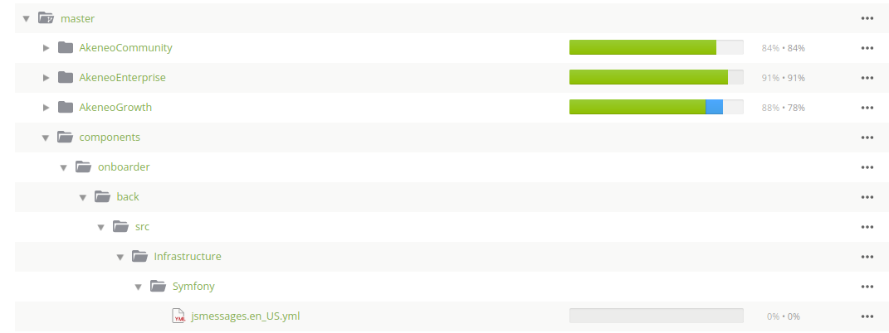

# How is the Supplier Portal translated?

We are using the same tools as the PIM to handle translations:

* [Crowdin](https://crowdin.com/project/akeneo)
* [Nelson](https://github.com/akeneo/nelson)

## Crowdin

The translation keys that we define in our YML files are pushed to the Crowdin platform every Friday at 5:00 a.m. UTC.

Those translation keys can be found here:

When a translator creates new translations in Crowdin, those translations are then pulled to the `pim-enterprise-dev`
repository using a tool called Nelson.

## Nelson

Nelson is an Akeneo tool allowing us to merge new translations from Crowdin into our Git repositories.
The translations are pulled from Crowdin everyday at 7:00 a.m. UTC.
Github PRs are automatically created and merged by a Github Akeneo Nelson user.

We are using our own configuration file for Supplier Portal. It is not under VCS, it is configured directly on the
Githook server.

The file paths are `/home/akeneo/nelson/config/supplier-portal-retailer.yml` and `/home/akeneo/nelson/config/supplier-portal-supplier.yml`.

## Troubeshooting

If you have some troubles to connect to the Githook server that hosts Nelson tool, check the following:

* You are connected to the Akeneo VPN
* Your SSH public key is on the [Akeneo ansible repository](https://github.com/akeneo/ansible/tree/master/keys/akeneo)

## Debugging

If you need to debug the synchronization between Nelson and Crowdin on the Githook server, you can check
  * the crontab using `crontab -l`
  * the following log files:
    * `/tmp/nelson_pull_supplier_portal_retailer.log`
    * `/tmp/nelson_push_supplier_portal_retailer.log`
    * `/tmp/nelson_pull_supplier_portal_supplier.log`
    * `/tmp/nelson_push_supplier_portal_supplier.log`
