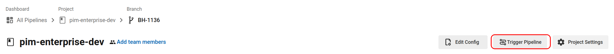
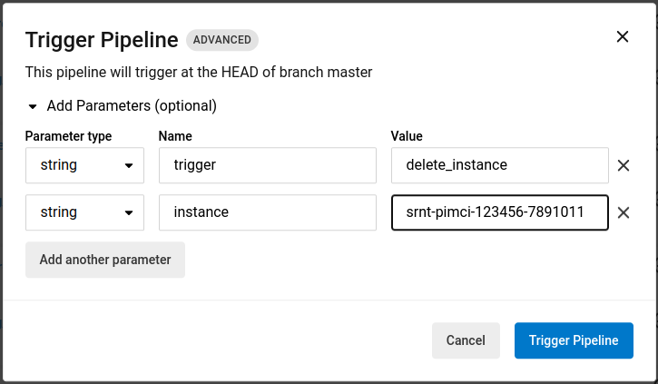

# Delete instances from dev cluster  

From [circleci](https://app.circleci.com/pipelines/github/akeneo/pim-enterprise-dev?branch=master), click on 
"Trigger pipeline" button (see screenshot below)

And then set following parameters :
* (boolean) trigger_delete_instance: true
* (string) instance: \<your full instance name\>

