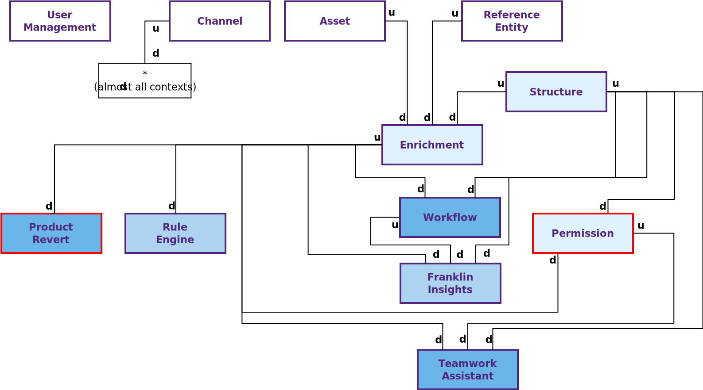

# You said "Bounded contexts"?

According to Eric Evans in [Domain-Driven Design Reference](https://domainlanguage.com/ddd/reference/), a bounded context is:

*"A description of a boundary (typically a subsystem, or the work of a particular team) within which a particular model is defined and applicable."*

Typically, a bounded context belongs to only one team, relates to only one topic (within which the ubiquitous language is used) and is decoupled from the others. Today, that's not the case for us. But this is the direction we'd like to go.

For now, we discover several bounded contexts but you should keep in mind that may evolve in the future!

- *User Management*: Enable enterprises to manage users from a central directory.
- *Channel*: The settings to distribute a product selection to a given target market, based on some geographical parameters.
- *Asset*: Allow users to manage the library of assets related to products.
- *Enriched Entity* (Enterprise Edition only): Enriched entities related to products with their own properties and lifecycle.
- *Enrichment*: Enable to create/update products to improve and follow their quality.
- *Structure*: The structure is the catalog foundations to modelize products. It should be tailored to customer needs.
- *Automation* (Enterprise Edition only): Automatically enrich product information inside the PIM to improve users productivity.
- *Permissions* (Enterprise Edition only): Allow for the separation of privileges by user group on the product information.
- *Work Organization* (Enterprise Edition only): Enable self-organization and collaboration with coworkers.
- *Tool*: Technical libraries that could be used outside Akeneo.
- *Platform*: Everything that glues all the other contexts together to make it a consistent application.

# Context map

A context map defines how bounded contexts communicate and are integrated together.

