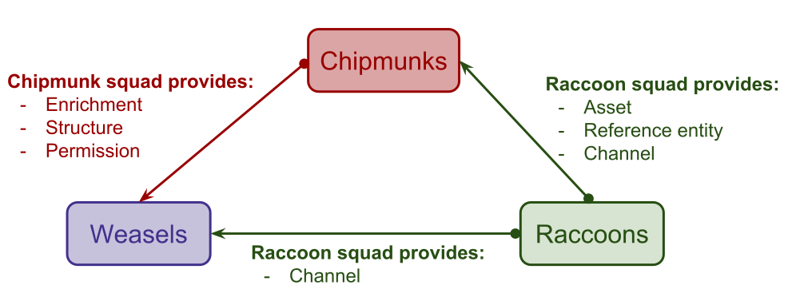
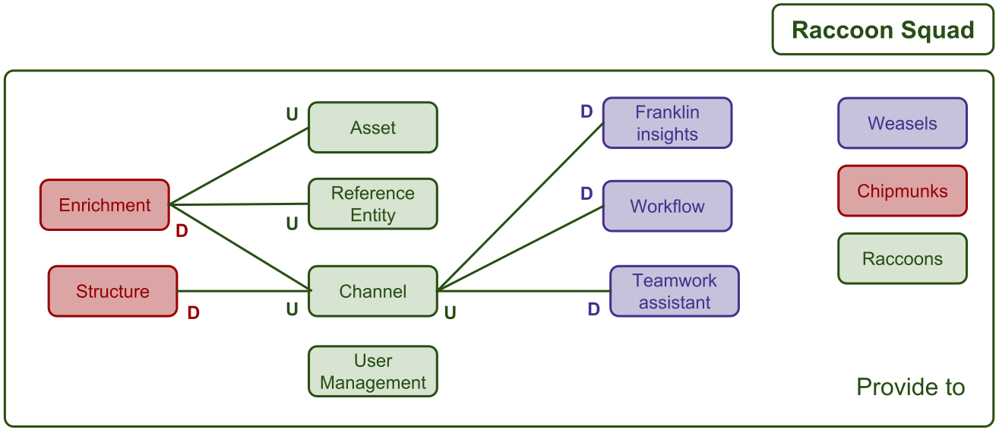
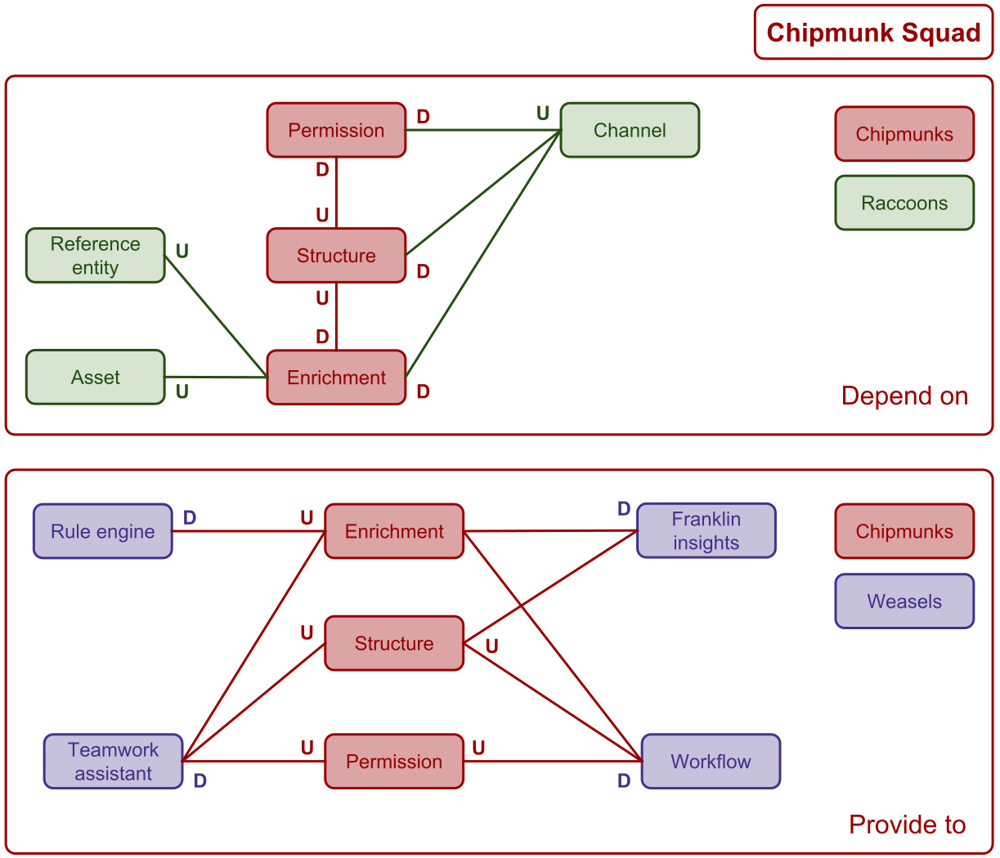
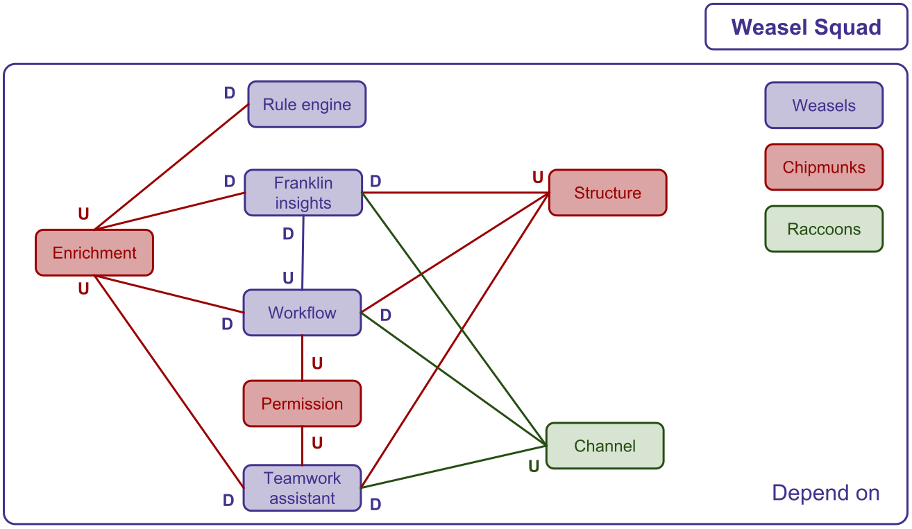

# What is a bounded context and a context map?

## Bounded context

> A bounded context represents a **functional perimeter**. 
> This is where a model is implemented and reflects a language spoken by every member of the team. 
> Typically, a bounded context belongs to only one team and is decoupled from the others. 

Today, that's not the case for us because our bounded contexts are coupled together. But this is the direction we'd like to go. We discovered several bounded contexts but **you should keep in mind that they are likely to evolve in the future!**  

### Definitions

- **User Management**: Define the users, their preferences and their functional perimeter, so that it reflects 
  the customer organization.
- **Channel**: The settings to distribute a product selection to a given market, based on some geographical parameters.
- **Asset Manager** (Enterprise Edition only): Library of media shared by several entities (products, reference entities, etc.) 
  to bring added value and leverage the product experience.
- **Reference entity** (Enterprise Edition only): Structured and rich data shared by several products 
  to bring added value and leverage the product experience.
- **Enrichment**: Bring added value to the products by enriching their information, 
  and follow their quality to create the basis of a compelling product experience.
- **Structure**: The structure is the catalog foundations to modelize products. It should be tailored to customer needs.
- **Permissions**: (Enterprise Edition only): Allow for the separation of privileges by user group on the product information.
- **Teamwork assistant** : Organize the teamwork around projects to follow the enrichment of a set of products 
  in order to increase users productivity.
- **Workflow**: Allow category managers to validate contributions from internal or external contributors.
- **Rule engine**: Enrich products by automating repetitive tasks based on business rules in order 
  to increase users' productivity.
- **Connectivity** : Manage connections with external systems and provides information and tools to ease connectivity.
- **Shared Catalogs**: Shared Catalogs helps you improve collaboration with your external and internal stakeholders 
  by easily sharing the latest product information from Akeneo PIM through a secured portal.
- **Trial Edition**: TODO
- **Tool**: Technical libraries that could be used outside Akeneo.
- **Platform**: Everything that glues all the other bounded contexts together to make it a consistent application.

## Context map

> A context map defines how bounded contexts communicate and are integrated together.

### How do we represent a relation?

- **U** means **Upstream**: this bounded context provides information to another one.
- **D** means **Downstream**: this bounded context uses information from another one.

### How can I update the context map?

All sketches are available [here](https://drive.google.com/drive/folders/1qAAjxexqvdvFJEeXp6Vb6LFSNCBVuTTL). Don't hesitate to change them if there is an error or if the relations evolve.

# How do we organize ourselves?

Each squad is in charge of several bounded contexts. 

This sketch shows the dependencies between squads:
- Raccoon squad is the only squad which only provides information to the other ones.
- Weasel is the only squad which only uses information from the other ones.
- Chipmunk is the squad which provides and uses information to/from the other ones.

## Raccoon squad

The raccoon squad handles the **User Management**, **Channel**, **Asset** and **Reference entity** bounded contexts.

### Definitions

- **User Management**: Define the users, their preferences and their functional perimeter, so that it reflects the customer organization.
- **Channel**: The settings to distribute a product selection to a given market, based on some geographical parameters.
- **Asset** (Enterprise Edition only): Library of media shared by several products to bring added value and leverage the product experience.
- **Reference entity** (Enterprise Edition only): Structured and rich data shared by several products to bring added value and leverage the product experience.

### Context map

**Caution:** We still need to work on the dependencies of the User management bounded context.

## Chipmunk squad

The chipmunk squad handles the **Enrichment**, **Structure**, **Permissions** bounded contexts.

### Definitions

- **Enrichment**: Bring added value to the products by enriching their information, and follow their quality to create the basis of a compelling product experience.
- **Structure**: The structure is the catalog foundations to modelize products. It should be tailored to customer needs.
- **Permissions**: (Enterprise Edition only): Allow for the separation of privileges by user group on the product information.

### Context map

## Weasel squad

The weasel squad handles **Teamwork assistant**, **Workflow**, **Rule engine** and **Franklin Insight** bounded contexts. 
Those bounded contexts are related to two main topics which are **Automation** and **Work Organization**.

### Definitions

#### Automation

> Automatically enrich product information inside the PIM to increase users' productivity.

- **Rule engine**: Enrich products by automating repetitive tasks based on business rules in order to increase users' productivity.

#### Work Organization

> Set of features that allows self-organization and collaboration with teammates in order to increase users' productivity.

- **Teamwork assistant** : Organize the teamwork around projects to follow the enrichment of a set of products in order to increase users productivity.
- **Workflow**: Allow category managers to validate contributions from internal or external contributors.

### Context map

## Octopus

The Octopus squad handles **Connection** bounded context.
This bounded context is related to the *Connectivity* topic and has dependencies with *User Management* and *Platform*.

### Definitions

#### Connectivity

> Set of features that eases connectivity with third party systems.

- **Connection** : Manage connections with external systems and provides information and tools to ease connectivity.

## Do we cover all PIM code?

The answer is **No**. All teams are responsible of two other things: our tools and the platform.

- **Tool**: Technical libraries that could be used outside Akeneo.
- **Platform**: Everything that glues all the other bounded contexts together to make it a consistent application.
