*This document is an extract of this [PR](https://github.com/akeneo/pim-community-dev/pull/7523) which introduces the search on categories for products and product models.*

The result of a search of products and product models in the product grid heavily relies on multiple factors:
- The structure of the family variants the variant products and product models belongs to;
- The categories in wich the product and product models are in;
- The search condition made by the user (eg, the clauses of the search)

*This document defines the business need regarding the search usecase and describes how we technically make it work.*

# Context

Prior to 2.2, the search of product models in the datagrid was not fully functional with categories. To be more precise, the search was not properly working when a user would only filter on categories.

Before explaining how I propose to solve this issue, we need to understand how the datagrid search works prior to 2.2 and its pitfalls.

## Datagrid search (Also known as 'Smart search') prior to 2.2

### Data set: Shoes

Let's say we have a product model 'shoe' and it's variance by size and color (2 levels):

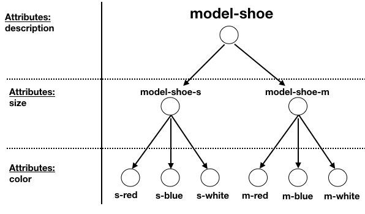

### Naïve filtering by attribute

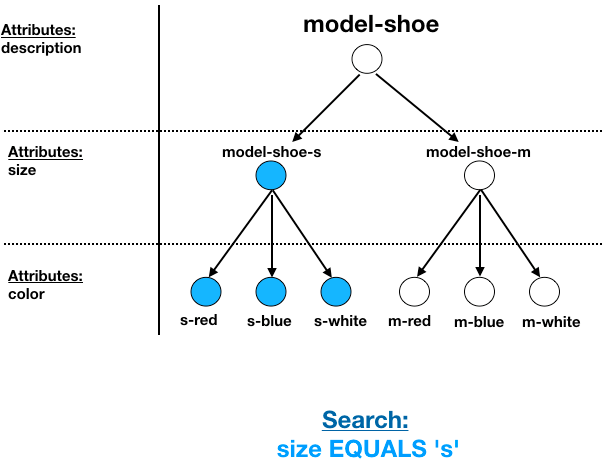

_(The node in blue correspond to lines shown in the datagrid)_

In this search, you can see that the search is quite naïve in the sense that it returns all the entities having a size 's'.

This search does not correspond to our business need because it is very noisy and it does not aggregate the result towards higher product model in the hierarchy, well it is not "Smart".

### Smart filtering by attribute

The Smart Search feature could also be translated as **"Show me the most relevant nodes corresponding to my search criterias"**

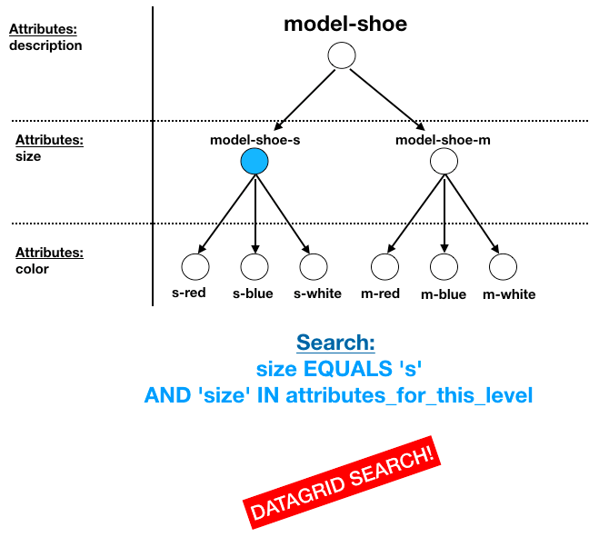

To achieve it, you can see that we use additional information (indexed in ES) like 'attribute_for_this_level'. This property is the cornerstone of the working of the actual search because it gives us the opportunity to **differienciate** nodes of one level from other levels, hence showing to the user the right node (in the right level) corresponding to the search criterias.

## Pitfalls

### Search on Categories does not work

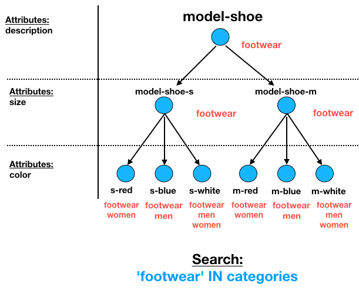

But if you look for the 'footwear' category, all the node of the tree are returned where in fact in this case, we only want the node **'model-shoe'** to be shown to the user (because it's the most relevant).

## Expected results examples

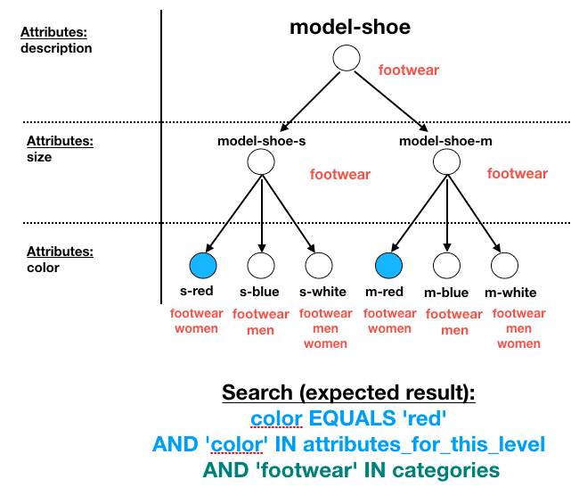

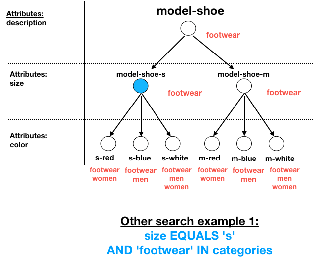

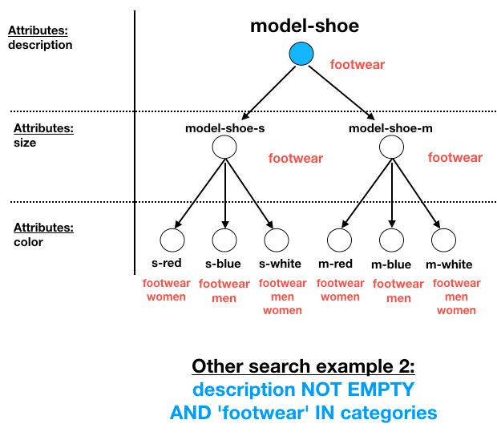

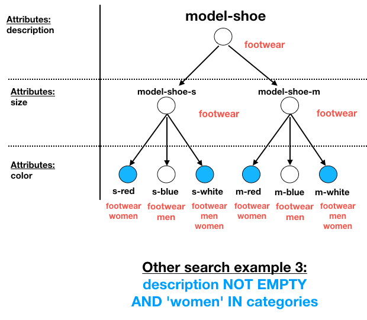


## Brainstorming

### Idea # 1: could we use a 'categories\_for\_this\_level' ?

Could we use the same mecanism to select the node to show when selecting categories with something similar we use with the attributes ?

Yes, in this case we can index the "categories\_for\_this\_level" of each node in our tree.

**A search in the form of:**
```
'footwear' IN categories AND 'footwear' in categories_for_this_level
  ↓
'model-shoe'
```
returns the 'model-shoe' node and that's what we want !

**BUT**: Let's see how this request performs when we also filter on some attributes

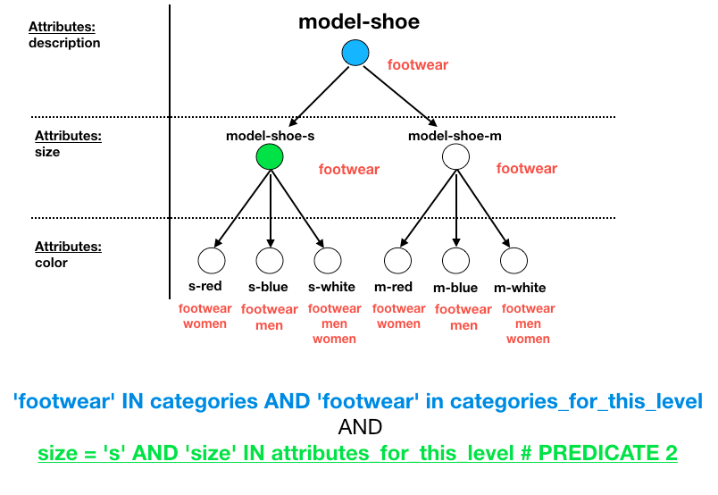

The predicate #1 here will return 'model-shoe' just like before
The predicate #2 will return 'model-shoe-s'
The intersection of those set is unfortunately **empty**.

The difficulty here is we have to deal with one data structure (Product model hierarchy) which depends on one meta structure (the family variant attribute sets) and is linked to another datastructure (the category tree).

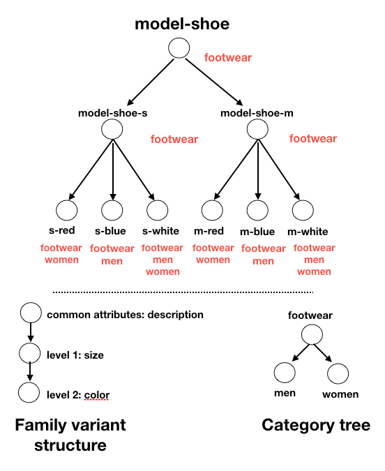

**Is it possible to conciliate both meta structure in the search to always show the topmost / most relevant node in the hierarchy depending on the search criterias ?**

# Proposed solution

The proposed solution has been discussed with @pierallard and @willy-ahva. (_Thanks to them for the help!)_

Just like before, it relies on the ability to differentiate nodes of one level from another by indexing additional information.

## Filtering on attribute and categories

We generalised the 'attribute_for_this_level' notion to create 'attributes_of_ancestors' which has the cummulative list of attributes of the parents.

The question we want to ask now changed from :
"Which level owns the property X that we try to filter on" **to** "Which node has a property that its ancestors don't have".

In fact those statements looks quite the same, but the later enable us to also ask the question:
"Which node has a category that its ancestors don't have" by indexing a new property called "categories_of_ancestors".

The good news is that combining "attributes_of_ancestors" and "categories_of_ancestors" help us achieve a "Smart search" supporting the search on attributes as well as on categories.

**The general search condition looks like this:**
```
Attribute_1 = 'value' AND 'attribute_X' = 'another_value' AND
Category = 'category_1' AND
NOT( attributes_of_ancestors HAS 'attribute_1' AND attributes_of_ancestors HAS 'attribute_X' AND categories_of_ancestors HAS 'category_1')
```

### Testing our solution

Let's take our failing search example back from above: "'footwear' IN category"

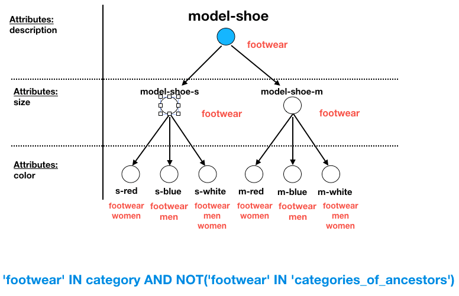

The only one node, not having a parent holding the 'footwear' category is the 'model-shoe' node. So that makes sense.

Let's try to mix it up with a filter on attributes: Let's say a user wants to filter "footwear' IN category AND size = 's'" in the datagrid.

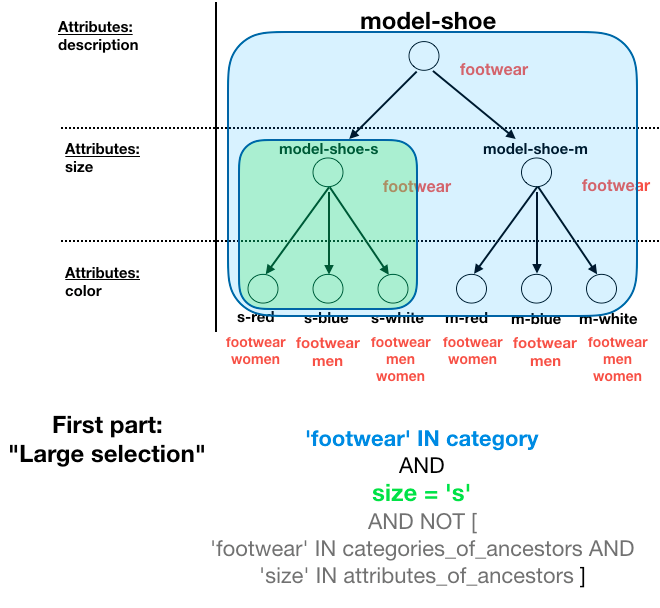

This first part of the request is inclusive, it returns all the nodes matching at least the criterias of the user (category is 'footwear' and the size is 's').
**For sure, the right answer lies within this selection**, and it is the second part of the request that will help us to find it.

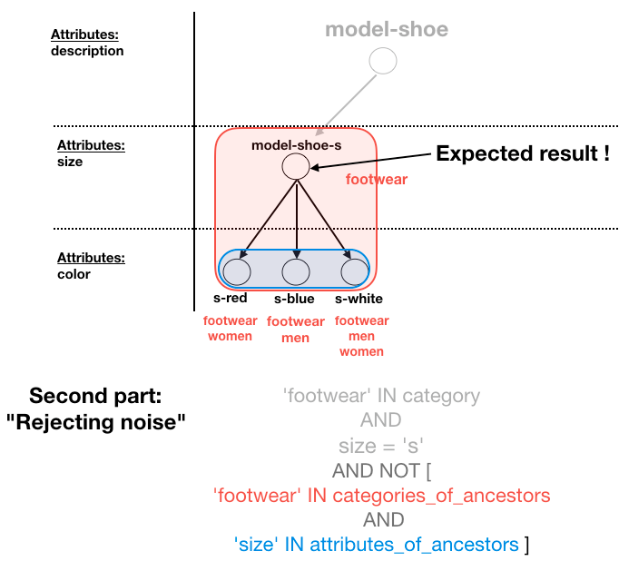

The second part of the request, excludes the nodes that are children: by saying "within the large selection" excludes all the nodes which have a parent already holding the property (therefore they are children). In the end, the only nodes not removed are the topmost nodes matching the criterias.

## Updated ES document

In the example above the "s-red" node would be indexed as followed in ES:
```
{
  "_id": "s-red",
  "parent": "model-shoe-s",
  "categories": ["footwear", "women"],
  "categories_of_ancestors": ["footwear"],
  "attributes_of_ancestors": ["description", "size"],
  "values": [
  ...
  ]
}
```

## Example ES query

**Search on category: category = "men"**
```
        $query = [
            'query' => [
                'constant_score' => [
                    'filter' => [
                     // Above is some ES boilerplate to deactivate scoring
                        'bool' => [
                            'filter'   => [
                                [
                                    'terms' => ['categories' => ['men']],
                                ],
                                [
                                    'bool' => [
                                        'must_not' => [
                                            'bool' => [
                                                'filter' => [
                                                    [
                                                        'terms' => ['categories_of_ancestors' => ['men']]
                                                    ]
                                                ]
                                            ]
                                        ]
                                    ]
                                ]
                            ],
                        ],
                    ],
                ],
            ],
        ];
```
https://github.com/akeneo/pim-community-dev/blob/0bc9783562812cd62caed2f34b6dd23da1c25aed/src/Pim/Bundle/CatalogBundle/tests/integration/Elasticsearch/IndexConfiguration/SearchProductsAndModelsIntegration.php#L1004

**Search on attribute: color = 'red'**
```
        $query = [
            'query' => [
                'constant_score' => [
                    'filter' => [
                        'bool' => [
                            'filter' => [
                                [
                                    'terms' => ['values.color-option.<all_channels>.<all_locales>' => ['red']],
                                ],
                                [
                                    'bool' => [
                                        'must_not' => [
                                            'bool' => [
                                                'filter' => [
                                                    [
                                                        'terms' => ['attributes_of_ancestors' => ['color']],
                                                    ],
                                                ],
                                            ],
                                        ],
                                    ],
                                ],
                            ],
                        ],
                    ],
                ],
            ]
        ];
```
https://github.com/akeneo/pim-community-dev/blob/0bc9783562812cd62caed2f34b6dd23da1c25aed/src/Pim/Bundle/CatalogBundle/tests/integration/Elasticsearch/IndexConfiguration/SearchProductsAndModelsIntegration.php#L121

**Search on both Category and attributes: category = 'shoes' and color = 'white'**
```
        $query = [
            'query' => [
                'constant_score' => [
                    'filter' => [
                        'bool' => [
                            'filter'   => [
                                [
                                    'terms' => ['categories' => ['shoes']],
                                ],
                                [
                                    'terms' => ['values.color-option.<all_channels>.<all_locales>' => ['white']],
                                ],
                                [
                                    'bool' => [
                                        'must_not' => [
                                            'bool' => [
                                                'filter' => [
                                                    [
                                                        'terms' => ['attributes_of_ancestors' => ['color']],
                                                    ],
                                                    [
                                                        'terms' => ['categories_of_ancestors' => ['shoes']]
                                                    ]
                                                ]
                                            ]
                                        ]
                                    ]
                                ]
                            ],
                        ],
                    ],
                ],
            ],
        ];
```
https://github.com/akeneo/pim-community-dev/blob/0bc9783562812cd62caed2f34b6dd23da1c25aed/src/Pim/Bundle/CatalogBundle/tests/integration/Elasticsearch/IndexConfiguration/SearchProductsAndModelsIntegration.php#L955
