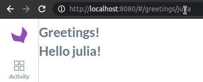

# Creating a new Backbone page

This is an example of adding a new page "greetings" with its controller and views using the form extensions system.




For more examples and explanations take a look at the [Akeneo PIM Frontend Guide (medium.com/akeneo-labs)](https://medium.com/akeneo-labs/akeneo-pim-frontend-guide-part-1-bd398b6483a2)

## Setup

For the following example, we will enable and use the **AcmeAppBundle** in the Community Edition.
```php
// config/bundles.php
Acme\Bundle\AppBundle\AcmeAppBundle::class => ['all' => true],
```

## Create the main view

```ts
// src/Acme/Bundle/AppBundle/Resources/public/js/greetings/greetings.ts

const View = require('pim/form');
const translate = require('oro/translator');

type Config = {
  title: string;
};

class Greetings extends View {
  config: Config;

  initialize({config}: {config: Config}) {
    this.config = config;
  }

  render() {
    this.$el.html(`
        <h1>${translate(this.config.title)}</h1>
        <div data-drop-zone="content"></div>
    `);

    super.render();
  }
}

export = Greetings;
```

## Create a child view to be included in the drop-zone "content" of the main view

```ts
// src/Acme/Bundle/AppBundle/Resources/public/js/greetings/display-name.ts

const View = require('pim/form');
const translate = require('oro/translator');

class DisplayName extends View {
  render() {
    // Get data from the root model
    const {name} = this.getFormData();

    this.$el.html(`
        <h1>${translate('Hello {{ name }}!', {name})}</h1>
    `);

    super.render();
  }
}

export = DisplayName;

```

## Create the controller

```ts
// src/Acme/Bundle/AppBundle/Resources/public/js/controller/greetings.ts

const BaseController = require('pim/controller/front');
const FormBuilder = require('pim/form-builder');

type Route = {
  params: {
    name: string;
  };
};

class GreetingsController extends BaseController {
  renderForm(route: Route) {
    // Build the root form extension
    return FormBuilder.build('acmeapp-greetings').then(form => {
      // Get/Fetch some data using url params for example, and store it in the root model
      form.setData({name: route.params.name});

      // Attach the view to the DOM and render it
      form.setElement(this.$el).render();

      return form;
    });
  }
}

export = GreetingsController;
```

## Create the route

```yml
# src/Acme/Bundle/AppBundle/Resources/config/routing.yml

acme_app_greetings:
    path: '/greetings/{name}'
```

> Make sure that the bundle routing configuration is correctly loaded
>
> ```yml
> # config/routes/routes.yml
> acme_app:
>     resource: "@AcmeAppBundle/Resources/config/routing.yml"
> ```

## Add the modules configuration for requirejs

```yml
# src/Acme/Bundle/AppBundle/Resources/config/requirejs.yml

config:
    config:
        pim/controller-registry:
            controllers:
                # Controller to use when the route "acme_app_greetings" is matched
                acme_app_greetings:
                    module: acmeapp/controller/greetings

    # Alias for each typescript module
    paths:
        acmeapp/controller/greetings: acmeapp/js/controller/greetings.ts
        acmeapp/greetings: acmeapp/js/greetings/greetings.ts
        acmeapp/greetings/display-name: acmeapp/js/greetings/display-name.ts

```

## Add the form extensions configuration

```yml
# src/Acme/Bundle/AppBundle/Resources/config/form_extensions.yml

extensions:
    # Root form extension and its configuration
    acmeapp-greetings:
        module: acmeapp/greetings
        config:
            title: 'Greetings!'

    # Child view to include in the target zone "content" of the root form extension
    acmeapp-greetings-display-name:
        module: acmeapp/greetings/display-name
        parent: acmeapp-greetings
        targetZone: content

```

## Check the result 🎉

Go to [http://localhost:8080/#/greetings/julia](http://localhost:8080/#/greetings/julia)
