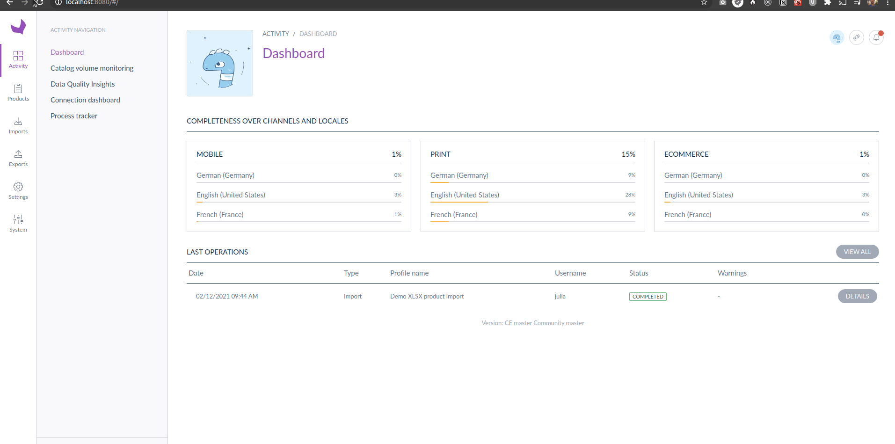

# How to render a React application with a Backbone controller?



## Activate the controller in the PIM

Register the controller and define the path for requireJs:

```yaml
config:
  pim/controller-registry:
    # ...
    controllers:
      # ...
      my_app_index:
            module: pim/controller/my-app
  paths:
    # ...
    path-to-the-controller/my-app: a-public-assets-symfony-bundle/js/controller/MyBridgeAppController
    # ...

```

Configure the routing for Symfony and FosJsRouting:

```yaml
# ...
my_app_index:
  path: /my-app
# ...
```

Define a menu entry (optional)

```yaml
# ...
pim-menu-settings-my-app:
    module: pim/menu/item
    parent: pim-menu-settings-navigation-block
    position: 200
    config:
        title: My app
        to: my_app_index
# ...
```

## Render your React app with a Backbone controller

```tsx
import React from "react";
import { ReactController } from "@akeneo-pim-community/legacy-bridge/src/bridge/react";
import { MyApp } from "./MyApp";

// You may need to use the mediator module in the case you want to add your controller as a menu entry
const mediator = require("oro/mediator");

class MyBridgeAppController extends ReactController {
  reactElementToMount() {
    return <MyApp />;
  }

  routeGuardToUnmount() {
    return /my_app_index/;
  }

  /*
   * @optional
   * In the case you are using your controller as an entry of an existing menu, the `pim-menu-settings` for instance
   * Do not forget to trigger right events to highlight menu entry
   */
  renderRoute() {
    mediator.trigger("pim_menu:highlight:tab", {
      extension: "pim-menu-settings",
    });
    mediator.trigger("pim_menu:highlight:item", {
      extension: "pim-menu-settings-my-app",
    });

    return super.renderRoute();
  }
}

export = MyBridgeAppController;
```

```tsx
import React, { FC } from "react";
import { DependenciesProvider } from "@akeneo-pim-community/legacy-bridge";
import styled, { ThemeProvider } from "styled-components";
import { CityIllustration, pimTheme } from "akeneo-design-system";

const Container = styled.div`
  margin: 40px;
`;

const MyApp: FC = () => {
  return (
    <DependenciesProvider>
      <ThemeProvider theme={pimTheme}>
        <Container>
          <h1>MY REACT APP</h1>
          <CityIllustration />
        </Container>
      </ThemeProvider>
    </DependenciesProvider>
  );
};

export { MyApp };
```

In order to use the PIM context, when we implement a React application by using the `ReactController`, we need to define manually the `DependenciesProvider` and the `ThemeProvider` contexts in our React application.
