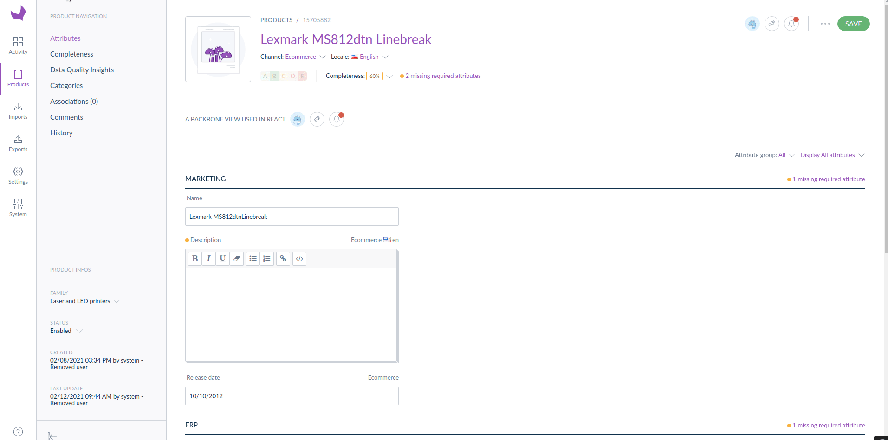

# How to render a React application in with a Backbone controller?

# How to render a React component in a Backbone view?

## How to share data and events between the Backbone view and the React component?

## Use a Backbone view in React

### Illustration


---

### Activate the view in the PIM

Define the path for requireJs:

```yaml
config:
	paths:
		# ...
		path-to-the-view/my-view: a-public-assets-symfony-bundle/js/view/MyBridgeView.ts
		# ...
```

Configure the form extension:

```yaml
extensions:
	# ...

	## Add MyView extension module in the Product Edit Form
	pim-product-edit-form-my-view:
	    module: path-to-the-view/my-view
	    parent: pim-product-edit-form 
	    targetZone: content
	    position: 30 # define the position you need

	# ...
```

---

### Use the PimView component

```tsx
import {MyView} from './MyView';

const BaseView = require('pimui/js/view/base');

class MyBridgeView extends BaseView {
  public render() {
    this.renderReact(MyView, {}, this.el);

    return this;
  }
}

export = MyBridgeView;
```

```tsx
import React, {FC} from 'react';
import styled from 'styled-components';
import {PimView} from '@akeneo-pim-community/legacy-bridge';

const Container = styled.div`
  display: flex;
  flex-direction: row;
  align-items: center;
  margin-top: 50px;
  margin-bottom: 50px;
`;

const Title = styled.div`
  margin-right: 10px;
`;

const MyView: FC = () => {
  return (
    <Container>
      <Title>A BACKBONE VIEW USED IN REACT</Title>
      <PimView
        viewName="pim-menu-user-navigation"
        className="AknTitleContainer-userMenuContainer AknTitleContainer-userMenu"
      />
    </Container>
  );
};

export {MyView};
```

### Comments

The PimView component works well with the most of the Backbone views. It does not work if you try to use it with complex FormView or ControllerView (using renderRoute).

## Use React portals 

### Illustration



---

### Activate the view in the PIM

Define the path for requireJs:

```yaml
config:
	paths:
		# ...
		path-to-the-view/my-view: a-public-assets-symfony-bundle/js/view/MyBridgeView.ts
		# ...
```

Configure the form extension:

```yaml
extensions:
	# ...

	## Add MyView extension module in the Product Edit Form
	pim-product-edit-form-my-view:
	    module: path-to-the-view/my-view
	    parent: pim-product-edit-form 
	    targetZone: content
	    position: 30 # define the position you need

	# ...
```

---

### Use the PimView component

```tsx
import {MyView} from './MyView';

const BaseView = require('pimui/js/view/base');

class MyBridgeView extends BaseView {
  public render() {
    this.renderReact(MyView, {}, this.el);

    return this;
  }
}

export = MyBridgeView;
```

```tsx
import React, {FC} from 'react';
import styled from 'styled-components';
import {PimView} from '@akeneo-pim-community/legacy-bridge';

const Container = styled.div`
  display: flex;
  flex-direction: row;
  align-items: center;
  margin-top: 50px;
  margin-bottom: 50px;
`;

const Title = styled.div`
  margin-right: 10px;
`;

const MyView: FC = () => {
  return (
    <Container>
      <Title>A BACKBONE VIEW USED IN REACT</Title>
      <PimView
        viewName="pim-menu-user-navigation"
        className="AknTitleContainer-userMenuContainer AknTitleContainer-userMenu"
      />
    </Container>
  );
};

export {MyView};
```

### Comments

The PimView component works well with the most of the Backbone views. It does not work if you try to use it with complex FormView or ControllerView (using renderRoute).
