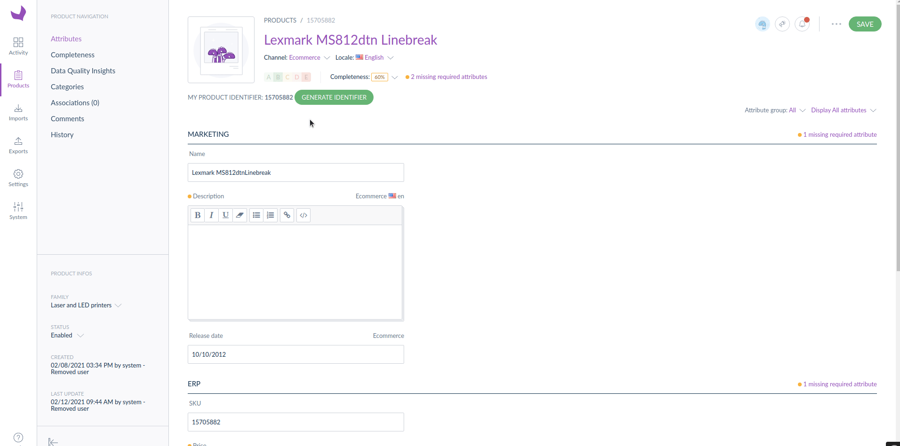

# How to render a React application in with a Backbone controller?

# How to render a React component in a Backbone view?

### Illustration


---

### Activate the view in the PIM

Define the path for requireJs:

```yaml
config:
	paths:
		# ...
		path-to-the-view/my-view: a-public-assets-symfony-bundle/js/view/MyBridgeView.ts
		# ...
```

Configure the form extension:

```yaml
extensions:
	# ...

	## Add MyView extension module in the Product Edit Form
	pim-product-edit-form-my-view:
	    module: path-to-the-view/my-view
	    parent: pim-product-edit-form 
	    targetZone: content
	    position: 30 # define the position you need

	# ...
```

---

### Use the PimView component

```tsx
import {MyView} from './MyView';

const BaseView = require('pimui/js/view/base');

class MyBridgeView extends BaseView {
  public render() {
    this.renderReact(MyView, {}, this.el);

    return this;
  }
}

export = MyBridgeView;
```

```tsx
import React, {FC} from 'react';
import styled from 'styled-components';
import {PimView} from '@akeneo-pim-community/legacy-bridge';

const Container = styled.div`
  display: flex;
  flex-direction: row;
  align-items: center;
  margin-top: 50px;
  margin-bottom: 50px;
`;

const Title = styled.div`
  margin-right: 10px;
`;

const MyView: FC = () => {
  return (
    <Container>
      <Title>A BACKBONE VIEW USED IN REACT</Title>
      <PimView
        viewName="pim-menu-user-navigation"
        className="AknTitleContainer-userMenuContainer AknTitleContainer-userMenu"
      />
    </Container>
  );
};

export {MyView};
```

The PimView component works well with the most of the Backbone views. It does not work if you try to use it with complex FormView or ControllerView (using renderRoute).

## How to share data and events between the Backbone view and the React component?

### Illustration



---

### Activate the view in the PIM

Define the path for requireJs:

```yaml
config:
	paths:
		# ...
		path-to-the-view/my-view: a-public-assets-symfony-bundle/js/view/MyBridgeView.ts
		# ...
```

Configure the form extension:

```yaml
extensions:
	# ...

	## Add MyView extension module in the Product Edit Form
	pim-product-edit-form-my-view:
	    module: path-to-the-view/my-view
	    parent: pim-product-edit-form 
	    targetZone: content
	    position: 30 # define the position you need

	# ...
```

---

### Use FormData and update it in the React component

```tsx
import {MyView} from './MyView';

const BaseView = require('pimui/js/view/base');

class MyBridgeView extends BaseView {
  public updateIdentifier(identifier: string): void {
    const data = this.getFormData();
    this.setData({
      ...data,
      identifier,
    });

    this.render();
  }

  public render() {
    this.renderReact(
      MyView,
      {
        product: this.getFormData(),
        updateIdentifier: this.updateIdentifier.bind(this), // Binding with `this` scope is important here
      },
      this.el
    );

    return this;
  }
}

export = MyBridgeView;
```

```tsx
import React, {FC} from 'react';
import {Button} from 'akeneo-design-system';

type Product = {
	identifier: string;
  // ...
};

type Props = {
  product: Product;
  updateIdentifier: (identifier: string) => void;
};

const MyView: FC<Props> = ({product, updateIdentifier}) => {
	const generateIdentifier = () => Math.random().toString(36).substring(7);

  return (
    <div>
      MY PRODUCT IDENTIFIER: <strong>{product.identifier}</strong>
      &nbsp;
      <Button
        onClick={() => {
          updateIdentifier(generateIdentifier());
        }}
      >
        Generate identifier
      </Button>
    </div>
  );
};

export {MyView};
```

In order to keep the consistency of the product information displayed in the example above, you may have to listen the `pim_enrich:form:entity:post_fetch` and force to render the module. For instance, the product data is refreshed after saving.

---

### Configure events and listeners to communicate in both way between the Backbone view and the React component

Use standard CustomEvent (not recommended)

```tsx
import {MyView} from './MyView';

const BaseView = require('pimui/js/view/base');

class MyBridgeView extends BaseView {
  public configure(): JQueryPromise<any> {
    // Listen events from React and handle them in Backbone
    window.addEventListener('my-view:product:identifier-generated', ((event: CustomEvent<{identifier: string}>) => {
      this.updateIdentifier(event.detail.identifier);
    }) as EventListener);

    // Listen events from Backbone and dispatch them to React
    this.listenTo(this.getRoot(), 'pim_enrich:form:entity:post_update', () => {
      window.dispatchEvent(new CustomEvent('my-view:product:updated'));
    });

    this.listenTo(this.getRoot(), 'pim_enrich:form:entity:post_fetch', () => {
      window.dispatchEvent(new CustomEvent('my-view:product:loaded'));
    });

    return super.configure();
  }

  public render() {
    this.renderReact(
      MyView,
      {
        product: this.getFormData(),
      },
      this.el
    );

    return this;
  }

  private updateIdentifier(identifier: string): void {
    const data = this.getFormData();
    this.setData({
      ...data,
      identifier,
    });

    this.render();
  }
}

export = MyBridgeView;
```

```tsx
import React, {FC, useCallback, useEffect, useState} from 'react';
import {Button, DangerIcon} from 'akeneo-design-system';

type Product {
	identifier: string;
};

type Props = {
  product: Product;
};

const MyView: FC<Props> = ({product}) => {
  const [isDirty, setIsDirty] = useState<boolean>(false);
  const generateIdentifier = useCallback(() => {
	  const identifier = Math.random().toString(36).substring(7);
	  window.dispatchEvent(
	    new CustomEvent('my-view:product:identifier-generated', {
	      detail: {
	        identifier,
	      },
	    })
	  );
	}, []);

  useEffect(() => {
    const handleProductUpdated = () => {
      setIsDirty(true);
    };
    const handleProductLoaded = () => {
      setIsDirty(false);
    };

    window.addEventListener('my-view:product:updated', handleProductUpdated);
    window.addEventListener('my-view:product:loaded', handleProductLoaded);

    return () => {
      window.removeEventListener('my-view:product:updated', handleProductUpdated);
      window.removeEventListener('my-view:product:loaded', handleProductLoaded);
    };
  }, []);

  return (
    <div>
      MY PRODUCT IDENTIFIER: <strong>{product.identifier}</strong>
      {isDirty && (
        <>
          &nbsp; <DangerIcon title="product is updated" />
        </>
      )}
      &nbsp;
      <Button onClick={generateIdentifier}>Generate identifier</Button>
    </div>
  );
};

export {MyView};
```

Use the mediator module

```tsx
import {MyView} from './MyView';

const BaseView = require('pimui/js/view/base');
const Mediator = require('oro/mediator');

class MyBridgeView extends BaseView {
  public configure(): JQueryPromise<any> {
    // Listen events from React and handle them in Backbone
    Mediator.on('my-view:product:identifier-generated', (identifier: string) => {
      this.updateIdentifier(identifier);
    });

    this.listenTo(this.getRoot(), 'pim_enrich:form:entity:post_update', () => {
      Mediator.trigger('my-view:product:updated');
    });

    this.listenTo(this.getRoot(), 'pim_enrich:form:entity:post_fetch', () => {
      Mediator.trigger('my-view:product:loaded');
    });

    return super.configure();
  }

  public render() {
    this.renderReact(
      MyView,
      {
        product: this.getFormData(),
      },
      this.el
    );

    return this;
  }

  private updateIdentifier(identifier: string): void {
    const data = this.getFormData();
    this.setData({
      ...data,
      identifier,
    });

    this.render();
  }
}

export = MyBridgeView;
```

```tsx
import React, {FC, useCallback, useEffect, useState} from 'react';
import {Button, DangerIcon} from 'akeneo-design-system';
import {useMediator} from '@akeneo-pim-community/legacy-bridge';

type Product {
	identifier: string;
};

type Props = {
  product: Product;
};

const MyView: FC<Props> = ({product}) => {
  const mediator = useMediator(); // The component has to be rendered with the DependenciesProvider
  const [isDirty, setIsDirty] = useState<boolean>(false);

  const generateIdentifier = useCallback(() => {
    const identifier = Math.random().toString(36).substring(7);
    // @ts-ignore | @fixme arguments declaration for the trigger method in the Mediator interface
    mediator.trigger('my-view:product:identifier-generated', identifier);
  }, [mediator]);

  useEffect(() => {
    const handleProductUpdated = () => {
      setIsDirty(true);
    };
    const handleProductLoaded = () => {
      setIsDirty(false);
    };

    mediator.on('my-view:product:updated', handleProductUpdated);
    mediator.on('my-view:product:loaded', handleProductLoaded);

    return () => {
      // @ts-ignore | @fixme add off and once methods in the Mediator interface
      mediator.off('my-view:product:updated', handleProductUpdated);
      // @ts-ignore | @fixme add off and once methods in the Mediator interface
      mediator.off('my-view:product:loaded', handleProductLoaded);
    };
  }, []);

  return (
    <div>
      MY PRODUCT IDENTIFIER: <strong>{product.identifier}</strong>
      {isDirty && (
        <>
          &nbsp; <DangerIcon title="product is updated" />
        </>
      )}
      &nbsp;
      <Button onClick={generateIdentifier}>Generate identifier</Button>
    </div>
  );
};

export {MyView};

```

## Use a Backbone view in React

### Illustration


---

### Activate the view in the PIM

Define the path for requireJs:

```yaml
config:
	paths:
		# ...
		path-to-the-view/my-view: a-public-assets-symfony-bundle/js/view/MyBridgeView.ts
		# ...
```

Configure the form extension:

```yaml
extensions:
	# ...

	## Add MyView extension module in the Product Edit Form
	pim-product-edit-form-my-view:
	    module: path-to-the-view/my-view
	    parent: pim-product-edit-form 
	    targetZone: content
	    position: 30 # define the position you need

	# ...
```

---

### Use the PimView component

```tsx
import {MyView} from './MyView';

const BaseView = require('pimui/js/view/base');

class MyBridgeView extends BaseView {
  public render() {
    this.renderReact(MyView, {}, this.el);

    return this;
  }
}

export = MyBridgeView;
```

```tsx
import React, {FC} from 'react';
import styled from 'styled-components';
import {PimView} from '@akeneo-pim-community/legacy-bridge';

const Container = styled.div`
  display: flex;
  flex-direction: row;
  align-items: center;
  margin-top: 50px;
  margin-bottom: 50px;
`;

const Title = styled.div`
  margin-right: 10px;
`;

const MyView: FC = () => {
  return (
    <Container>
      <Title>A BACKBONE VIEW USED IN REACT</Title>
      <PimView
        viewName="pim-menu-user-navigation"
        className="AknTitleContainer-userMenuContainer AknTitleContainer-userMenu"
      />
    </Container>
  );
};

export {MyView};
```

### Comments

The PimView component works well with the most of the Backbone views. It does not work if you try to use it with complex FormView or ControllerView (using renderRoute).

## Use React portals 

### Illustration


---

### Activate the view in the PIM

Define the path for requireJs:

```yaml
config:
	paths:
		# ...
		path-to-the-view/my-view: a-public-assets-symfony-bundle/js/view/MyBridgeView.ts
		# ...
```

Configure the form extension:

```yaml
extensions:
	# ...

	## Add MyView extension module in the Product Edit Form
	pim-product-edit-form-my-view:
	    module: path-to-the-view/my-view
	    parent: pim-product-edit-form 
	    targetZone: content
	    position: 30 # define the position you need

	# ...
```

---

### Use the PimView component

```tsx
import {MyView} from './MyView';

const BaseView = require('pimui/js/view/base');

class MyBridgeView extends BaseView {
  public render() {
    this.renderReact(MyView, {}, this.el);

    return this;
  }
}

export = MyBridgeView;
```

```tsx
import React, {FC} from 'react';
import styled from 'styled-components';
import {PimView} from '@akeneo-pim-community/legacy-bridge';

const Container = styled.div`
  display: flex;
  flex-direction: row;
  align-items: center;
  margin-top: 50px;
  margin-bottom: 50px;
`;

const Title = styled.div`
  margin-right: 10px;
`;

const MyView: FC = () => {
  return (
    <Container>
      <Title>A BACKBONE VIEW USED IN REACT</Title>
      <PimView
        viewName="pim-menu-user-navigation"
        className="AknTitleContainer-userMenuContainer AknTitleContainer-userMenu"
      />
    </Container>
  );
};

export {MyView};
```

### Comments

The PimView component works well with the most of the Backbone views. It does not work if you try to use it with complex FormView or ControllerView (using renderRoute).
