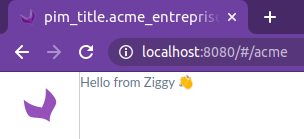

# How to create an independant frontend package

This guide explains the setup of an independent frontend package inside the PIM.

It comes with **some limitations** though, being independent means you can't import any function|class|component from outside the package.

For example, you can't import a javascript file directly from `pimui/js`.
But it works fine if the source is a standard `node_modules` package (or another Yarn workspace).

They also are limited by the underlying stack: backbone.js + custom code

More on this in the frontend controller section of this guide.

# Create a new React package 📦

Create a new folder for your frontend code, it can be located anywhere inside the PIM `src` folder apart from the `Resources/public/` folder of the Symfony bundles.

1. New `src/AcmeEnterprise/Ziggy` folder

1. Add a `package.json` configuration with the following rule for the package `name`:

   - `@akeneo-[project]/[package-name]`
   - For the enterprise edition `@akeneo-pim-enterprise/[package-name]`
   - For the community edition `@akeneo-pim-community/[package-name]`

   `src/AcmeEnterprise/Ziggy/package.json`

   ```json
   {
     "name": "@akeneo-pim-enterprise/ziggy",
     "version": "1.0.0",
     "main": "src/index.ts",
     "private": true
   }
   ```

1. New HelloZiggy component

   `src/AcmeEnterprise/Ziggy/src/HelloZiggy.tsx`

   ```tsx
   import React, { FC } from "react";

   export const HelloZiggy: FC = () => {
     return <>Hello from Ziggy 👋</>;
   };
   ```

1. New entry point for the package; the `main` property of the `package.json` must point to this file.

   `src/AcmeEnterprise/Ziggy/src/index.ts`

   ```ts
   import { HelloZiggy } from "./HelloZiggy";

   export { HelloZiggy };
   ```

   > Only export components and/or functions that you want to expose to the outside world

# Setup the yarn workspace

See the documentation on [Yarn workspaces](./yarn-workspaces.md)

Add the yarn workspace to the root `package.json`

```json
{
  "workspaces": ["src/AcmeEnterprise/Ziggy"]
}
```

This allows you to use the package anywhere in the PIM via:

```js
import { HelloZiggy } from "@akeneo-pim-enterprise/ziggy";
```

# Create a new page 📄 with React

> For the following examples we will enable and use the **AcmeEnterpriseBundle**
>
> `config/bundles.php`
>
> ```php
> return [
>     AcmeEnterprise\Bundle\AppBundle\AcmeEnterpriseAppBundle::class => ['all' => true]
> ];
> ```

## Create a new frontend controller

1. Create your first frontend route

   `src/AcmeEnterprise/Bundle/AppBundle/Resources/config/routing.yml`

   ```yml
   acme_entreprise_app_index:
     path: "/acme"
   ```

   > Make sure that the bundle routing configuration is correctly loaded
   >
   > `config/routes/routes.yml`
   >
   > ```yml
   > acme_entreprise_app:
   >   resource: "@AcmeEnterpriseAppBundle/Resources/config/routing.yml"
   > ```

   The route will be accessible under the following URL: `http://localhost:8080/#/acme`

1. Create the controller that will render the page with your React component

   `src/AcmeEnterprise/Bundle/AppBundle/Resources/public/js/controller/index.ts`

   ```ts
   import { HelloZiggy } from "@akeneo-pim-enterprise/ziggy";
   import { Deferred } from "jquery";
   import { createElement } from "react";
   import { render, unmountComponentAtNode } from "react-dom";

   const BaseController = require("pim/controller/base");

   class IndexController extends BaseController {
     renderRoute() {
       render(createElement(HelloZiggy), this.el);

       return Deferred().resolve();
     }

     remove() {
       unmountComponentAtNode(this.el);

       return super.remove();
     }
   }

   export = IndexController;
   ```

   > ⚠️ If your goal is to have a small app inside the PIM with differents routes (URLs) using the same React component tree (useful for sharing a global state), you will need to go the extra miles and hack around the legacy routing system to avoid backbone mounting|unmounting the React app on each URL change.
   >
   > Check out the `ReactController.ts` to have a base controller that can handle this use case.

1) Add the newly created controller module and his configuration to the `requirejs.yml` configuration file.

   `src/AcmeEnterprise/Bundle/AppBundle/Resources/config/requirejs.yml`

   ```yml
   config:
     config:
       pim/controller-registry:
         controllers:
           acme_entreprise_app_index:
             module: acmeenterpriseapp/controller/index

     paths:
       acmeenterpriseapp/controller/index: acmeenterpriseapp/js/controller/index.ts
   ```

## Check the result 🎉

Go to [http://localhost:8080/#/acme](http://localhost:8080/#/acme)


