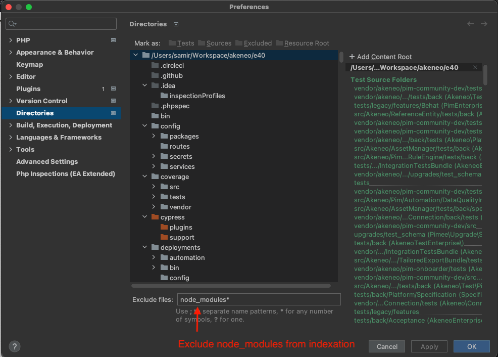
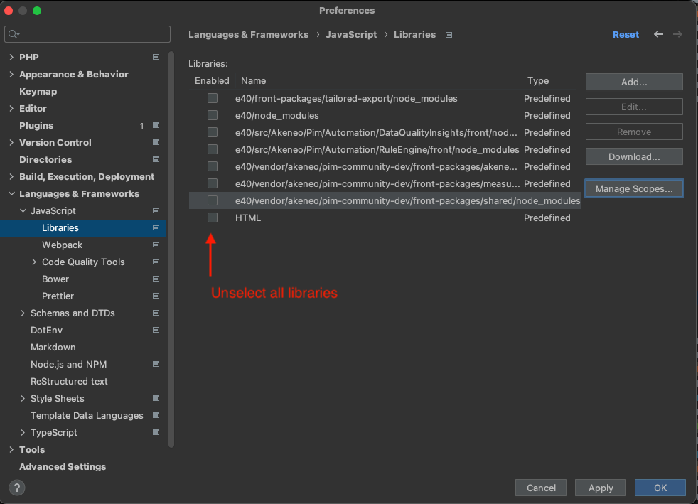

# PHPStorm configuration

## Troubleshooting

**PHPStorm keeps indexing the "node_modules" directory non stop and sometimes end-up frozen. What should I do ?**

Out of the box, PHPStorm might index the front-end libraries available in the _"node_modules"_ directory. 
In the PIM EE, there might be multiple places where node_modules are located:

- In the _"grth"_ folder
- In micro-frontends located in _"front-packages"_ directory

When compiling the PIM front-end, you might see PHPStorm reindexing the project to the point where it freezes the editor altogether.

To fix this issue, you can check the following things in your PHPStorm editor:
1. Exclude all _"node_modules"_ directories as shown in the screenshot below. Go in _"Preferences > Directories"_.

2. Exclude the _"grth"_ folder
3. Disable the javascript libraries by unselecting all of them in _"Preferences > Languages & Frameworks > Javascript > Libraries"_

4. **Restart PHPStorm** so those changes take effect immediately
