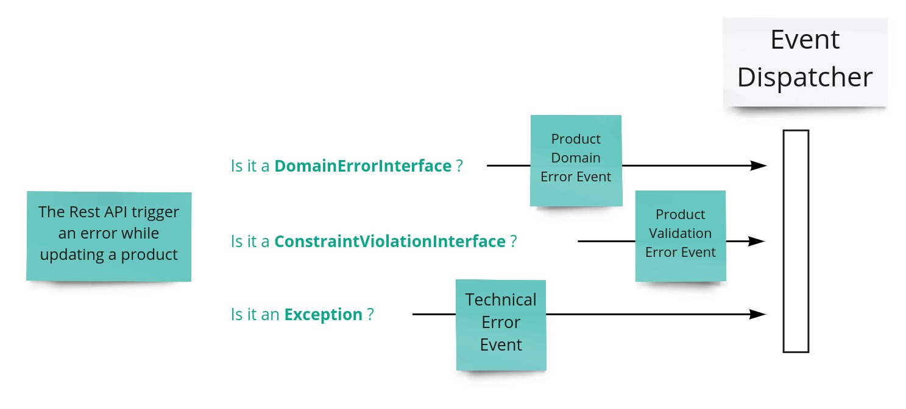
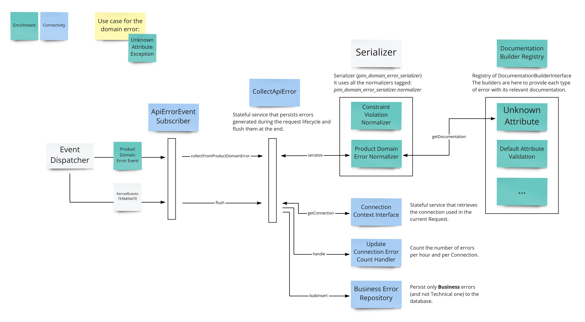

# Error management

Error management is part of the connection monitoring feature.

It gives information on business errors that happened during product synchronization with source connections.

# Error events

# Error monitoring

The goal is to display the last 100 business errors with a rich message and some helpful links.

See the [connection monitoring page documentation](https://help.akeneo.com/pim/serenity/articles/connection-dashboard.html#error-monitoring).

## Architecture

