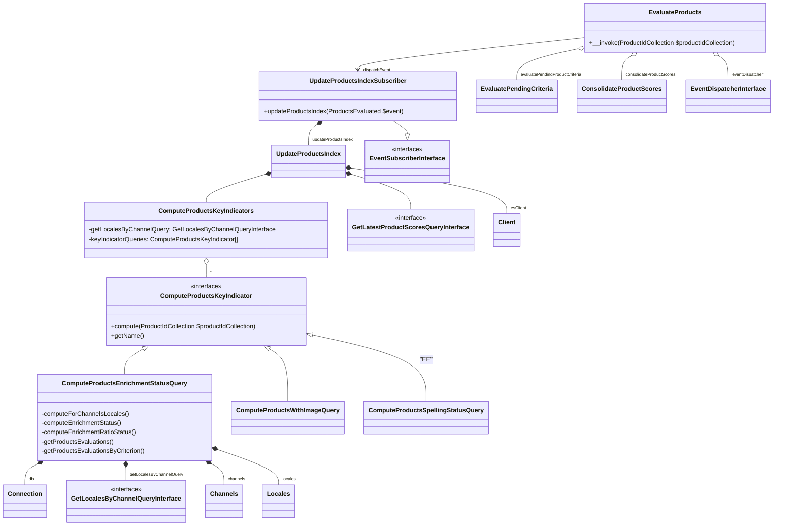

# Compute Key Indicators when products are evaluated
Illustrate the services used to compute Key Indicators when product have been evaluated

```mermaid
classDiagram
  class ComputeProductsEnrichmentStatusQuery {
    -computeForChannelsLocales()
    -computeEnrichmentStatus()
    -computeEnrichmentRatioStatus()
    -getProductsEvaluations()
    -getProductsEvaluationsByCriterion()
  }
  class ComputeProductsWithImageQuery 
  class ComputeProductsSpellingStatusQuery
  class ComputeProductsKeyIndicator {
     <<interface>>
    +compute(ProductIdCollection $productIdCollection)
    +getName()
  }
  class ComputeProductsKeyIndicators {
    -getLocalesByChannelQuery: GetLocalesByChannelQueryInterface
    -keyIndicatorQueries: ComputeProductsKeyIndicator[]
  }
  class Connection
  class GetLocalesByChannelQueryInterface {
    <<interface>>
  }
  class Channels
  class Locales 
  class UpdateProductsIndex
  class GetLatestProductScoresQueryInterface {
    <<interface>>
  }
  class Client
  class UpdateProductsIndexSubscriber {
    +updateProductsIndex(ProductsEvaluated $event)
  }
  class EventSubscriberInterface {
    <<interface>>
  }
  class EvaluateProducts {
    +__invoke(ProductIdCollection $productIdCollection)
  }
  class EvaluatePendingCriteria
  class ConsolidateProductScores
  class EventDispatcherInterface
  
  ComputeProductsKeyIndicator <|--  ComputeProductsEnrichmentStatusQuery
  ComputeProductsKeyIndicator <|--  ComputeProductsWithImageQuery
  ComputeProductsKeyIndicator <|--  ComputeProductsSpellingStatusQuery : "EE"
  ComputeProductsKeyIndicators o-- "*" ComputeProductsKeyIndicator
  
  ComputeProductsEnrichmentStatusQuery *-- "db" Connection
  ComputeProductsEnrichmentStatusQuery *-- "getLocalesByChannelQuery" GetLocalesByChannelQueryInterface
  ComputeProductsEnrichmentStatusQuery *-- "channels" Channels
  ComputeProductsEnrichmentStatusQuery *-- "locales" Locales
  
  
  UpdateProductsIndex *-- GetLatestProductScoresQueryInterface
  UpdateProductsIndex *-- ComputeProductsKeyIndicators
  UpdateProductsIndex *-- "esClient" Client
  
  UpdateProductsIndexSubscriber *-- "updateProductsIndex" UpdateProductsIndex
  UpdateProductsIndexSubscriber --|> EventSubscriberInterface
  
  
  EvaluateProducts --> "dispatchEvent" UpdateProductsIndexSubscriber
  EvaluateProducts o-- "evaluatePendingProductCriteria" EvaluatePendingCriteria
  EvaluateProducts o-- "consolidateProductScores" ConsolidateProductScores
  EvaluateProducts o-- "eventDispatcher" EventDispatcherInterface 
  
```

