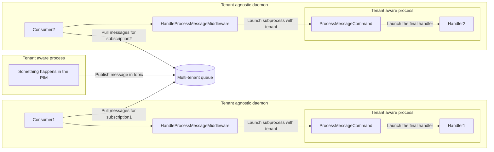

# Akeneo Messenger Bundle

This bundle provides the missing pieces to integrate [Symfony Messenger](https://symfony.com/doc/4.4/messenger.html) with the PIM.

## Messenger transport for Google Pub/Sub

The transport requires the library ["google/cloud-pubsub"](https://packagist.org/packages/google/cloud-pubsub).

It follows the official Symfony documentation on [creating a custom transport](https://symfony.com/doc/4.4/messenger/custom-transport.html).

The environment variable `SRNT_GOOGLE_APPLICATION_CREDENTIALS` must be defined with the file path of the JSON file that contains your [service account key](https://cloud.google.com/docs/authentication/getting-started#setting_the_environment_variable).

### Simple queue configuration

For a simple configuration of a Pub/Sub topic with only one subscription:

```yml
framework:
  messenger:
    transports:
      my_queue:
        dsn: 'gps:'
        options:
          project_id: '%env(GOOGLE_CLOUD_PROJECT)%'
          topic_name: '%env(PUBSUB_TOPIC)%'
          subscription_name: '%env(PUBSUB_SUBSCRIPTION)%'

    routing:
      'My\Event': my_queue
```

### Queue with multiple subscribers

Google Pub/Sub uses a [subscription model](https://en.wikipedia.org/wiki/Publish%E2%80%93subscribe_pattern) and it means that one topic can have more than one subscription.

To be able to handle this, we recommend having multiple transport definitions with one that serves as Producer only while the other ones are Consumers.

```yml
framework:
  messenger:
    transports:
      # Producer

      my_producer:
        dsn: 'gps:'
        options:
          project_id: '%env(GOOGLE_CLOUD_PROJECT)%'
          topic_name: '%env(PUBSUB_TOPIC)%'

      # Consumers

      my_first_consumer:
        dsn: 'gps:'
        options:
          project_id: '%env(GOOGLE_CLOUD_PROJECT)%'
          topic_name: '%env(PUBSUB_TOPIC)%'
          subscription_name: '%env(PUBSUB_SUBSCRIPTION_1)%'

      my_second_consumer:
        dsn: 'gps:'
        options:
          project_id: '%env(GOOGLE_CLOUD_PROJECT)%'
          topic_name: '%env(PUBSUB_TOPIC)%'
          subscription_name: '%env(PUBSUB_SUBSCRIPTION_2)%'

    routing:
      'My\Event': my_producer
```

From the Symfony Messenger point of view, these are three independent queues. But from Pub/Sub point of view, all messages sent to the producer will be dispatched to the consumers.

### Transport Options

- `topic_name: string`

- `subscription_name: ?string`

  Optional, but if the option is not defined you won't be able to receive messages from this transport.

- `auto_setup: ?bool`

  Default to `false`, but can be enabled to make the transport create the topic and subscription for you.
  This is useful when using the in-memory [Pub/Sub emulator](https://cloud.google.com/pubsub/docs/emulator) (enabled when the environment variable `PUBSUB_EMULATOR_HOST` is defined).

  **Important**: do not activate the auto setup in production. Otherwise the PIM will try to setup the transport
  (meaning check the existence of the table for doctrine, the existence of topics/subscriptions for Google PubSub, and so on)
  that will lead to degraded performance. Plus be aware for Google PubSub the checks perform some administrator operations
  which are limited by quotas (c.f. https://cloud.google.com/pubsub/quotas).

- `subscription_filter: ?string`

  Default to `null`, it allows to filter messages. See https://cloud.google.com/pubsub/docs/filtering for the syntax.  
  Be careful with this feature, currently the filter cannot be updated. It is defined only at the subscription creation.  

## Purge command for the Doctrine transport table

Define a command to purge the Doctrine transport database table of outdated messages.

```sh
bin/console akeneo:messenger:doctrine:purge-messages <table-name> <queue-name>
```

The retention time can be specified with the option `--retention-time=<seconds>`, which has a default value of 7200 seconds (or 2 hour).


## Easy configuration of queues and consumers

This bundle also provides a way to facilitate the setup of multi-tenant queues and consumers.
This stack is built to consume messages quickly and to launch short processes, **5 minutes maximum**.
If your process exceed 5 minutes, please consider cut your process in shorter ones, or use the job stack
that is designed for long-running job.

### How it works

When sending a message in the queue, the tenant is automatically injected into the envelope/message.
The consumer (the Symfony command `messenger:consume`) receive the messages of several tenants and pass them one bye one in a dedicated bus. 
This bus has a single middleware (`HandleProcessMessageMiddleware`) that extracts the tenant from the message's envelope and launch the
good process in a tenant aware process.



### Configuration

The easy configuration is done in the file `config/messages.yml`. For each message you just need to define a queue and all the consumers you need. 
A consumer must have a name and a dedicated handler service. (This handle can be the same as for the classic configuration)

Example:
```yaml
queues:
    pim_enrichment_product_was_updated:
        message_class:  Akeneo\Pim\Enrichment\Product\API\Event\ProductWasUpdated
        consumers:
            - name: dqi_product_was_updated_consumer
              service_handler: 'Akeneo\Pim\Automation\DataQualityInsights\Infrastructure\Messenger\ProductWasUpdatedHandler'
```

### Where my messages are sent?

Depending on the APP_ENV, the queues use the according transport. In general here is the configuration, 
but we can find more details in the `config/packages/*/messenger.php` files.

| Env        | Transport         |
|------------|-------------------|
| dev        | doctrine          |
| test       | PubSub            |
| test_fake  | In Memory         |
| behat      | PubSub            |
| prod       | doctrine / PubSub |

### Prerequisites

Each message/event must have a normalizer/de-normalizer declared with the tag `akeneo_messenger.message.normalizer`
And that implement `Symfony\Component\Serializer\Normalizer\NormalizerInterface` and `Symfony\Component\Serializer\Normalizer\DenormalizerInterface` 

Example:
```yaml
    Akeneo\Pim\Automation\DataQualityInsights\Infrastructure\Messenger\LaunchProductAndProductModelEvaluationsMessageNormalizer:
        tags:
            - { name: akeneo_messenger.message.normalizer }
```

### More details

- How to send/consume message

Send a message:

```php
// Bus service 'messenger.bus.default'
$this->bus->dispatch($message);
```

Launch consumer:

```bash
bin/console messenger:consume <consumer_name> --bus=pim_event.handle.bus
```

- [How to add a queue?](docs/how-to-add-a-queue.md)
